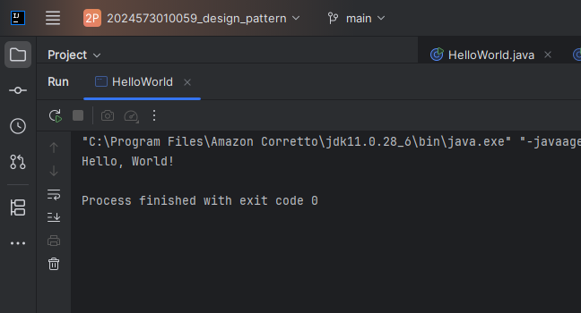
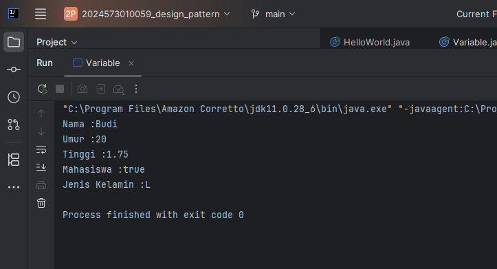
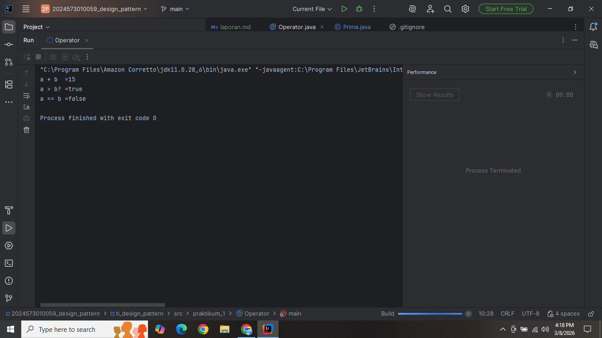
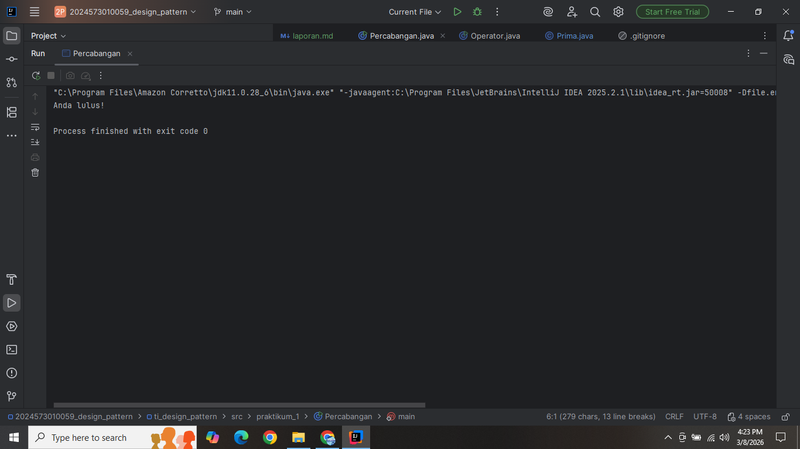
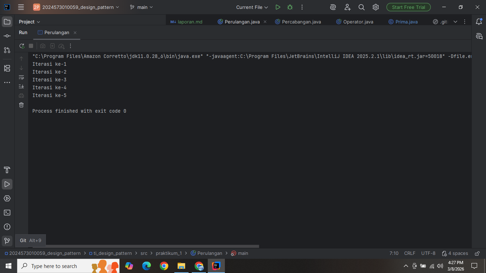
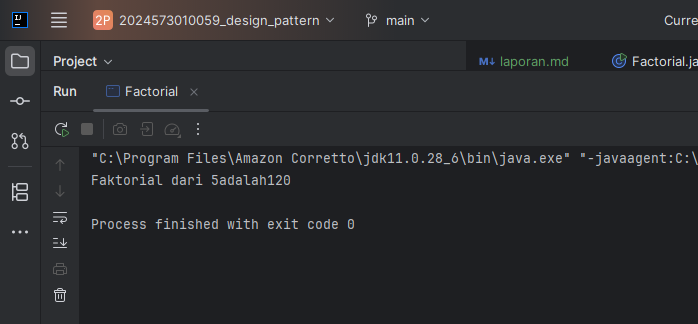
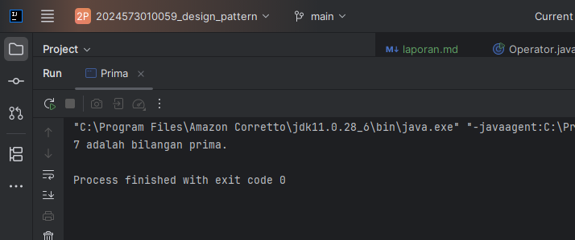
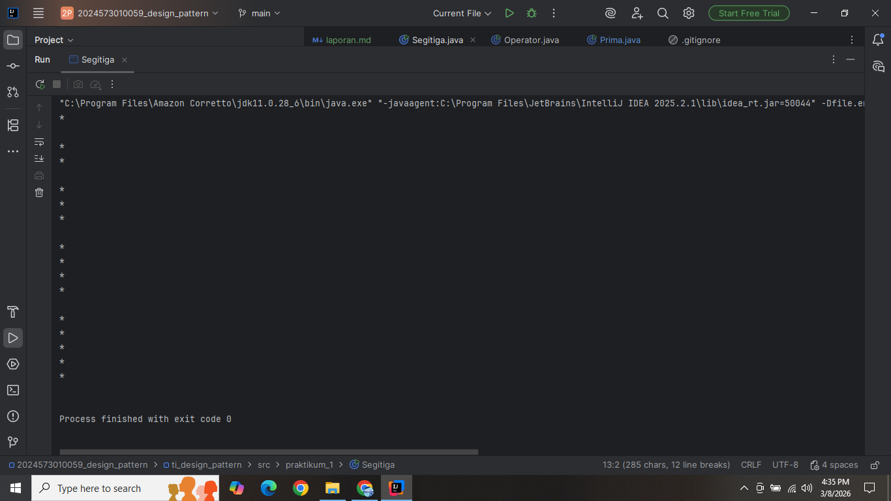

# Laporan 1 Review Dasar Pemrograman Java
**Mata Kuliah:** Praktikum Design Pattern  
**Nama:** Nisrina Nadhifah Enesta  
**NIM:** 2024573010059  
**Kelas:** TI 2A

---

## BAB I - PENDAHULUAN

### 1.1 Latar Belakang 
# Laporan Praktikum Dasar Pemrograman Java

## Latar Belakang
Perkembangan teknologi informasi saat ini sangat berkaitan dengan kemampuan dalam bidang pemrograman. Salah satu bahasa pemrograman yang banyak digunakan dalam pengembangan perangkat lunak adalah Java. Java dikenal sebagai bahasa pemrograman yang bersifat multiplatform, sehingga program yang dibuat dapat dijalankan pada berbagai sistem operasi selama terdapat Java Virtual Machine (JVM).

Dalam mempelajari pemrograman, pemahaman terhadap konsep dasar sangat penting. Konsep dasar tersebut meliputi sintaks dasar pemrograman, penggunaan variabel dan tipe data, operator, percabangan, serta perulangan. Konsep-konsep ini merupakan dasar dalam membuat suatu program agar dapat berjalan sesuai dengan logika yang diinginkan.

Oleh karena itu, praktikum ini dilakukan untuk membantu mahasiswa memahami dasar-dasar pemrograman Java secara langsung melalui latihan pembuatan program sederhana. Dengan melakukan praktikum ini, diharapkan mahasiswa dapat memahami bagaimana cara menuliskan program Java dan menerapkan konsep dasar pemrograman dalam menyelesaikan permasalahan sederhana.

## Tujuan Praktikum
Tujuan dari praktikum ini adalah:
1. Memahami sintaks dasar pemrograman Java.
2. Mampu membuat program sederhana menggunakan Java.
3. Memahami konsep variabel, tipe data, operator, percabangan, dan perulangan.
4. Mampu menyelesaikan masalah sederhana dengan menerapkan konsep dasar pemrograman Java.

## Dasar Teori

### 1. Pengenalan Java dan Lingkungan Pengembangan
Java merupakan bahasa pemrograman berorientasi objek yang dikembangkan oleh Sun Microsystems dan sekarang dimiliki oleh Oracle. Java dirancang agar dapat dijalankan di berbagai platform dengan prinsip *Write Once, Run Anywhere*. Untuk menjalankan program Java diperlukan Java Development Kit (JDK) yang berisi compiler dan Java Runtime Environment (JRE).

### 2. Variabel dan Tipe Data
Variabel merupakan tempat untuk menyimpan data di dalam program. Setiap variabel memiliki tipe data tertentu yang menentukan jenis nilai yang dapat disimpan. Beberapa tipe data dasar dalam Java antara lain `int`, `double`, `char`, `boolean`, dan `String`. Penggunaan tipe data yang tepat sangat penting agar program dapat berjalan dengan benar.

### 3. Operator dan Ekspresi
Operator adalah simbol yang digunakan untuk melakukan operasi terhadap suatu nilai atau variabel. Dalam Java terdapat beberapa jenis operator seperti operator aritmatika (`+`, `-`, `*`, `/`), operator perbandingan (`==`, `!=`, `>`, `<`), serta operator logika (`&&`, `||`, `!`). Operator digunakan dalam ekspresi untuk menghasilkan suatu nilai tertentu.

### 4. Percabangan (If-Else dan Switch-Case)
Percabangan digunakan untuk mengambil keputusan dalam program berdasarkan kondisi tertentu. Struktur percabangan yang sering digunakan dalam Java adalah `if`, `if-else`, dan `switch-case`. Dengan percabangan, program dapat menentukan tindakan yang berbeda sesuai dengan kondisi yang diberikan.

### 5. Perulangan (For, While, Do-While)
Perulangan digunakan untuk menjalankan suatu perintah secara berulang-ulang selama kondisi tertentu terpenuhi. Java menyediakan beberapa jenis perulangan seperti `for`, `while`, dan `do-while`. Struktur ini sangat membantu ketika program perlu melakukan proses yang sama berkali-kali.


## BAB II - PRAKTIKUM
### 2.1 Praktikum 1 - Pengenalan Java dan Lingkungan Pengembangan

1. Pastikan JDK dan Intellij IDE Community Edition sudah terinstal. Jika belum, kunjungi url berikut untuk mengunduh JDK Amazon Correto dan Intellij
2. Buka IDE dan buat sebuah project baru dengan ketentuan seperti berikut:
*       Name: ti_design_pattern
*       Location: disesuaikan
*       Build system: Intellij
*       JDK: Amazon Correto
*       Hilangkan centang pada bagian add sample code
* Buat sebuah package baru di dalam folder src dengan cara klik kanan pada folder src kemudian pilih New -> Package. Beri nama modul_1.
* Buat Sebuah class didalam package modul_1 dengan cara klik kanan dan pilih New -> Java Class. Beri nama HelloWorld
* Isikan kode dibawah ini.

          package praktikum_1;
  
          public class HelloWorld {
          public static void main(String[] args) {
          System.out.println("Hello, World!");}
          }
* Jalankan program dengan menekan tombol segitiga hijau seperti ditunjukkan pada lingkaran biru pada gambar dibawah ini.
* Hasilnya :



### 2.2 Praktikum 2 - Variabel dan Tipe Data
* Buat sebuah class baru di dalam package modul_1 dan beri nama Variable
* Tuliskan kode berikut:
        
            package praktikum_1;
            
            public class Variable {
            public static void main(String[] args){
            int umur = 20;
            double tinggi = 1.75;
            boolean isMahasiswa = true;
            char jenisKelamin = 'L';
            String nama = "Budi";
    
            System.out.println("Nama :"+ nama);
            System.out.println("Umur :"+ umur);
            System.out.println("Tinggi :"+ tinggi);
            System.out.println("Mahasiswa :"+ isMahasiswa);
            System.out.println("Jenis Kelamin :"+ jenisKelamin);
    
                }
            }

* Jalankan program nya untuk melihat hasil.
Hasilnya :
  


**_2.2.1 Latihan**_
Buatlah program untuk menampilkan data diri anda yang lengkap dengan attribut seperti berikut:
Nama Lengkap, Tempat Lahir, Tanggal Lahir, Golongan Darah, Umur,
Tinggi Badan, Jenis Kelamin, Agama, Pekerjaan.
Gunakan tipe data yang tepat untuk setiap variabel.

Buatkan sebuah package baru di dalam package modul_1 dan beri nama latihan. Kemudian, buat sebuah class dengan nama disesuaikan dengan tugas. Kemudian tuliskan solusi anda di dalam class tersebut.


### 2.3 Praktikum 3 -  Operator dan Expressi
Buat sebuah class baru di dalam package modul_1 dan beri nama Operator
Tuliskan kode berikut:

        package praktikum_1;
        
        public class Operator {
        public static void main (String[] args){
        int a = 10;
        int b = 5;

        System.out.println("a + b  =" + (a + b));
        System.out.println("a > b? =" + (a > b));
        System.out.println("a == b =" + (a == b));
            }
        }

Jalankan program nya untuk melihat hasil.
Hasinya :


**_2.3.1 Latihan**_
Buat program untuk menghitung luas persegi panjang (panjang * lebar)


### 2.4 Praktikum 4 -  Percabangan (If-Else dan Switch-Case)
* Buat sebuah class baru di dalam package modul_1 dan beri nama Percabangan
* Tuliskan kode berikut:

        package praktikum_1;
        
        public class Percabangan {
        public static void main(String[]args){
        int nilai = 85;

        if (nilai >= 75) {
            System.out.println("Anda lulus!");
        } else {
            System.out.println("Anda tidak lulus.");
        }
        }
    }

* Jalankan program nya untuk melihat hasil.
Hasilnya :
  

Latihan
Buat program untuk menentukan apakah suatu bilangan genap atau ganjil.

### 2.5 Praktikum 5 - Perulangan (For, While, Do-While)
Buat sebuah class baru di dalam package modul_1 dan beri nama Perulangan
Tuliskan kode berikut:
    
    package praktikum_1;
    
    public class Perulangan {
    public static void main(String [] args){
    for(int i = 1;i<= 5; i++) {
    System.out.println("Iterasi ke-" + i);
    }
    }
    }

Jalankan program nya untuk melihat hasil.
Hasilnya :



Latihan
Buat program untuk mencetak bilangan ganjil dari 1 hingga 20. Buat 3 program dengan menggunakan for, while, do-while.

### 2.6 Praktikum 6 Practice Problem dan Solusinya
   Practice Problem:
* Buat program untuk menghitung faktorial dari suatu bilangan.
* Buat program untuk mengecek apakah suatu bilangan adalah bilangan prima.
* Buat program untuk mencetak pola segitiga menggunakan *.

Solusi
Buat sebuah class baru di dalam package modul_1 dan beri nama Factorial dan isikan kode berikut. Kemudian jalankan untuk melihat hasilnya.

        package praktikum_1;
        
        public class Factorial {
        public static void main(String [] args) {

        int n = 5;
        int hasil = 1;
        for (int i = 1; i <= n; i++) {
            hasil *= i;
        }
        System.out.println("Faktorial dari " +  n  + "adalah" + hasil);
            }
        
        }
* Jalankan program nya untuk melihat hasil.
  


Buat sebuah class baru di dalam package modul_1 dan beri nama Prima dan isikan kode berikut. Kemudian jalankan untuk melihat hasilnya.

        public class Prima {
        public static void main(String[] args) {
        int n = 7;
        boolean isPrima = true;

        for (int i = 2; i <= n / 2; i++) {
            if (n % i == 0) {
                isPrima = false;
                break;
            }
        }

        System.out.println(n + (isPrima ? " adalah bilangan prima." : " bukan bilangan prima."));
            }
        }
* Jalankan program nya untuk melihat hasil.
  

Buat sebuah class baru di dalam package modul_1 dan beri nama Segitiga dan isikan kode berikut. Kemudian jalankan untuk melihat hasilnya.

        package praktikum_1;
        
        public class Segitiga {
        public static void main(String[] args) {
        int tinggi = 5;
        for (int i = 1; i <= tinggi; i++) {
        for (int j=1; j<= i; j++){
        System.out.println("* ");
        }
        System.out.println();
        }
        }
        }
* Jalankan program nya untuk melihat hasil.
  


# Laporan Modul 7: Polymorphism
**Mata Kuliah:** Praktikum Pemrograman Berorientasi Objek   
**Nama:** Safira Naila
**NIM:** 2024573010066
**Kelas:** TI 2A

---

## BAB I - PENDAHULUAN

### 1.1 Latar Belakang

&emsp;&emsp;Dalam konteks pemrograman OOP (Object Oriented Programming), istilah polymorphism sering digunakan karena berkaitan erat dengan salah satu pilar seperti class, object, method, atau inheritance. Polymorphism adalah banyak bentuk atau bermacam-macam. Dalam istilah pemrograman, polymorphism adalah sebuah konsep di mana sebuah interface tunggal digunakan pada entitas yang berbeda-beda. Umumnya, penggunaan suatu simbol tunggal berfungsi untuk mewakili beberapa jenis tipe entitas.

&emsp;&emsp;Polymorphism adalah konsep pemrograman yang berorientasi pada objek yang mengacu pada kemampuan variabel, fungsi atau objek untuk mengambil beberapa bentuk. Polymorphism adalah penggunaan salah satu item seperti fungsi, atribut, atau interface pada berbagai jenis objek yang berbeda dalam bahasa pemrograman. Dalam bahasa pemrograman yang menunjukkan polimorfisme, objek kelas miliki hierarki yang sama yang diwariskan dari kelas induk yang sama, mungkin memiliki fungsi dengan nama yang sama, tetapi dengan perilaku berbeda.Inheritance (Pewarisan) adalah salah satu prinsip fundamental dalam Object-Oriented Programming (OOP) yang memungkinkan sebuah class (subclass/child class) mewarisi sifat dan perilaku dari class lain (superclass/parent class). Dengan inheritance, kita dapat menghindari duplikasi kode dan meningkatkan reusability.

### 1.2 Tujuan Polymorphism

1. Flexibility - Memungkinkan kode yang lebih fleksibel dan mudah diperluas.
2. Code Reusability - Mengurangi duplikasi kode dengan menggunakan interface yang sama.
3. Maintainability - Memudahkan maintenance dan pengembangan fitur baru.
4. Dynamic Behavior - Perilaku objek ditentukan pada runtime
5. Interface Consistency - Konsistensi dalam penggunaan interface

### 1.4 Cara Implementasi

1. Gunakan inheritance hierarchy
2. Override method di subclass
3. Gunakan reference superclass untuk memegang objek subclass
4. Method yang dipanggil ditentukan pada runtime berdasarkan tipe aktual objek

### 1.3 Jenis-jenis Polymorphism
#### 1.3.1 Compile-time Polymorphism (Method Overloading)

&emsp;&emsp;Method overloading terjadi di mana sebuah class memiliki beberapa method dengan nama yang sama tetapi berbeda pada jumlah, tipe, atau urutan parameternya. Penentuan method mana yang digunakan dilakukan oleh compiler saat proses kompilasi, sehingga memberikan fleksibilitas dalam penggunaan method yang memiliki tujuan serupa namun menerima jenis input berbeda. Overloading membuat kode lebih efisien, mudah dibaca, dan menghindari penggunaan nama method yang terlalu banyak untuk fungsi yang sebenarnya sejenis.

**Aturan Method Overloading**

* Method harus memiliki nama dan parameter yang sama dengan method di superclass.
* Return type harus sama atau subtype dari return type di superclass.
* Access modifier tidak boleh lebih restriktif daripada method di superclass (misalnya, jika method di superclass protected, method di subclass bisa protected atau public).
* Method tidak bisa di-override jika di superclass dideklarasikan sebagai final.

#### 1.3.2 Runtime Polymorphism (Method Overriding)

&emsp;&emsp;Method overriding terjadi ketika subclass (class anak) menyediakan implementasi spesifik untuk method yang sudah didefinisikan di superclass (class induk). Method overriding digunakan untuk mengubah atau memperluas perilaku method yang diwarisi dari superclass. Method yang di-override harus memiliki nama, parameter, dan return type yang sama dengan method di superclass.

**Aturan Method Overriding**

* Memiliki nama method yang sama.
* Parameter harus berbeda (jumlah, tipe, atau urutan parameter).
* Return type boleh sama atau berbeda, karena tidak memengaruhi overloading.
* Boleh menggunakan access modifier atau tipe return bebas selama parameter berbeda.
* Overloading dapat terjadi dalam satu class atau antara superclass dan subclass.

---

## BAB II - PRAKTIKUM
### 2.1 Praktikum 1 - Memahami Method Overloading (Compile-time Polymorphism)
#### 2.1.1 Tujuan

&emsp;&emsp;Memahami konsep dan implementasi method overloading.

#### 2.1.2 Langkah Praktikum
1. Buat sebuah package baru di dalam package `modul_7` dengan nama `praktikum_1`
   Buat class `Calculator` dengan method overloading:
```declarative
package modul_7.praktikum_1;

public class Calculator {
    public int add(int a, int b) {
        System.out.println("Memanggil add(int a, int b)");
        return a + b;
    }
    
    public int add(int a, int b, int c) {
        System.out.println("Memanggil add(int a, int b, int c)");
        return a + b + c;
    }
    
    public double add(double a, double b) {
        System.out.println("Memanggil add(double a, double b)");
        return a + b;
    }
    
    public int add(int[] numbers) {
        System.out.println("Memanggil add(int[] numbers)");
        int sum = 0;
        for (int num : numbers) {
            sum += num;
        }
        return sum;
    }
    
    public String add(String a, String b) {
        System.out.println("Memanggil add(String a, String b)");
        return a + b;
    }
}
```

3. Buat class `OverloadingTest` untuk testing:
```declarative
package modul_7.praktikum_1;

public class OverloadingTest {
    public static void main(String[] args) {
        Calculator calc = new Calculator();
        
        System.out.println("Hasil : " + calc.add(5, 10));
        System.out.println();
        
        System.out.println("Hasil : " + calc.add(5, 10, 15));
        
        System.out.println("Hasil : " + calc.add(3.5, 2.7));
        System.out.println();
        
        int[] numbers = {1, 2, 3, 4, 5};
        System.out.println("Hasil : " + calc.add(numbers));
        System.out.println();
        
        System.out.println("Hasil : " + calc.add("Hello", "World"));
        System.out.println();
        
        System.out.println("Automatic Type Promotion:");
        System.out.println("Hasil : " + calc.add(5, 3.5));
    }
}
```

4. Jalankan program dan amati hasilnya
5. Perhatikan bagaimana compiler memilih method yang tepat berdasarkan parameter

#### 2.1.3 Hasil Praktikum


### 2.2 Praktikum 2 - Memahami Method Overriding (Runtime Polymorphism)
#### 2.2.1 Tujuan

&emsp;&emsp;Memahami konsep runtime polymorphism melalui method overriding.

#### 2.2.2 Langkah Praktikum
1. Buat sebuah package baru di dalam package `modul_7` dengan nama `praktikum_2`
2. Buat class `Shape` sebagai superclass:
```declarative
package modul_7.praktikum_2;

public class Shape {
    protected String color;
    
    public Shape(String color) {
        this.color = color;
    }
    
    public void draw() {
        System.out.println("Menggambar shape dengan warna : " + color);
    }
    
    public double calculateArea() {
        System.out.println("Menghitung luas secara umum");
        return 0.0;
    }
    
    public void displayInfo() {
        System.out.println("Shape - Warna : " + color);
    }
}
```

3. Buat class `Circle` yang mewarisi `Shape`:
```declarative
package modul_7.praktikum_2;

public class Circle extends Shape {
    private double radius;
    
    
    public Circle(String color, double radius) {
    super(color);
    this.radius = radius;
    }
    
    @Override
    public void draw() {
    System.out.println("Menggambar lingkaran dengan warna : " + color + " dan radius : " + radius);
    }
    
    @Override
    public double calculateArea() {
    double area = Math.PI * radius * radius;
    System.out.println("Luas Lingkaran : " + area);
    return area;
    }
    
    @Override
    public void displayInfo() {
    System.out.println("Lingkaran - Warna : " + color + ", dan Radius : " + radius);
    }
}
```

4. Buat class `Rectangle` yang mewarisi `Shape`:
```declarative
package modul_7.praktikum_2;

public class Rectangle extends Shape {
    private double width;
    private double height;
    
    public Rectangle(String color, double width, double height) {
        super(color);
        this.width = width;
        this.height = height;
    }
    
    @Override
    public void draw() {
        System.out.println("Menggambar Persegi Panjang dengan warna : " + color + ", Lebar : " + width + ", dan Tinggi : " + height);
    }
    
    @Override
    public double calculateArea() {
        double area = width * height;
        System.out.println("Luas Persegi Panjang : " + area);
        return area;
    }
    
    @Override
        public void displayInfo() {
        System.out.println("Persegi Panjang - Warna : " + color + ", Lebar : " + width + ", dan Tinggi : " + height);
    }
}
```

5. Buat class `Triangle` yang mewarisi `Shape`:
```declarative
package modul_7.praktikum_2;

public class Triangle extends Shape {
    private double base;
    private double height;
    
    public Triangle(String color, double base, double height) {
        super(color);
        this.base = base;
        this.height = height;
    }
    
    @Override
    public void draw() {
        System.out.println("Menggambar Segitiga dengan warna : " + color + ", Alas : " + base + ", dan Tinggi : " + height);
    }
    
    @Override
    public double calculateArea() {
        double area = 0.5 * base * height;
        System.out.println("Luas Segitiga : " + area);
        return area;
    }
    
    @Override
    public void displayInfo() {
        System.out.println("Segitiga - Warna : " + color + ", Alas : " + base + ", dan Tinggi : " + height);
    }
}
```

6. Buat class `PolymorphismTest` untuk testing:
```declarative
package modul_7.praktikum_2;

public class PolymorphismTest {
    public static void main(String[] args) {
        Shape[] shapes = new Shape[3];
        shapes[0] = new Circle("Merah", 5.0);
        shapes[1] = new Rectangle("Biru", 4.0,  6.0);
        shapes[2] = new Triangle("Hijau", 3.0, 4.0);
        
        System.out.println("--- POLYMORPHISM RUNTIME ---");
        for (Shape shape : shapes) {
            shape.draw();
            shape.calculateArea();
            shape.displayInfo();
            System.out.println();
        }
        
        System.out.println("--- INDIVIDUAL OBJECTS ---");
        Shape shape1 = new Circle("Kuning", 7.0);
        Shape shape2 = new Rectangle("Ungu", 5.0,  8.0);
        
        shape1.draw();
        shape2.draw();
        
        System.out.println("--- INDIVIDUAL OBJECTS ---");
        for (Shape shape : shapes) {
            if (shape instanceof Circle) {
                Circle circle = (Circle) shape;
                System.out.println("Ini adalah Circle dengan radius : " + circle.calculateArea());
            } else if (shape instanceof Rectangle) {
                Rectangle rectangle = (Rectangle) shape;
                System.out.println("Ini adalah Rectangle dengan luas: " + rectangle.calculateArea());
            } else if (shape instanceof Triangle) {
                Triangle triangle = (Triangle) shape;
                System.out.println("Ini adalah Triangle dengan luas: " + triangle.calculateArea());
            }
        }
    }
}
```

7. Jalankan program dan amati:
* Bagaimana method yang dipanggil ditentukan pada runtime
* Perilaku polimorfik dari objek-objek berbeda
* Penggunaan instanceof untuk type checking

#### 2.2.3 Screenshoot Hasil


---

## BAB III - PENUTUP

### 3.1 Kesimpulan

## Kesimpulan

Berdasarkan praktikum yang telah dilakukan, dapat disimpulkan bahwa bahasa pemrograman Java memiliki struktur dasar yang harus dipahami sebelum membuat program yang lebih kompleks. Dalam praktikum ini dipelajari beberapa konsep dasar seperti pengenalan Java, penggunaan variabel dan tipe data, operator, percabangan, serta perulangan.

Melalui praktikum ini, mahasiswa dapat memahami bagaimana cara membuat program sederhana menggunakan Java serta mengetahui bagaimana alur logika program bekerja. Variabel dan tipe data digunakan untuk menyimpan nilai, operator digunakan untuk melakukan operasi terhadap data, percabangan digunakan untuk pengambilan keputusan, dan perulangan digunakan untuk menjalankan proses secara berulang.

Dengan memahami konsep-konsep tersebut, mahasiswa diharapkan dapat mengembangkan kemampuan dasar dalam pemrograman serta mampu menerapkan logika pemrograman untuk menyelesaikan permasalahan sederhana menggunakan bahasa Java.

---

## BAB IV - REFERENSI
* Modul Praktikum 1 by Pak Muhammad Reza Zulman, S.ST., M.Sc.
    https://hackmd.io/@mohdrzu/BkBn4sEcyl
* W3Schools. "Java Tutorial". 
https://www.w3schools.com/java/
* Petani Kode. "Belajar Java untuk Pemula". 
https://www.petanikode.com/java-untuk-pemula/
