# Laporan 2  Konsep Dasar OOP Menggunakan Java
**Mata Kuliah:** Praktikum Design Pattern  
**Nama:** Nisrina Nadhifah Enesta  
**NIM:** 2024573010059  
**Kelas:** TI 2A

---

## BAB I - PENDAHULUAN

## 1.1 Latar Belakang
Perkembangan perangkat lunak yang semakin kompleks menuntut adanya metode pemrograman yang mampu menghasilkan program yang terstruktur, mudah dikembangkan, dan mudah dipelihara. Salah satu pendekatan yang banyak digunakan untuk memenuhi kebutuhan tersebut adalah pemrograman berorientasi objek atau Object-Oriented Programming (OOP). Pendekatan ini memungkinkan pengembang untuk memodelkan permasalahan dunia nyata ke dalam bentuk objek yang memiliki data dan perilaku.

Dalam bahasa pemrograman Java, konsep OOP menjadi dasar utama dalam proses pengembangan aplikasi. Java menyediakan berbagai fitur yang mendukung penerapan OOP, seperti class, object, method, serta mekanisme pengaturan akses data. Selain itu, terdapat pula konsep penting seperti enkapsulasi, inheritance, polymorphism, dan abstraction yang membantu dalam meningkatkan efisiensi serta fleksibilitas program.

Melalui penerapan konsep OOP, program dapat disusun secara modular sehingga memudahkan dalam pengelolaan kode, pengembangan lanjutan, serta pengurangan kesalahan. Oleh karena itu, praktikum ini dilakukan agar mahasiswa dapat memahami konsep dasar OOP secara lebih mendalam dan mampu mengimplementasikannya dalam bentuk program sederhana menggunakan bahasa Java.

## 1.2 Tujuan Praktikum
1. Memahami konsep dasar pemrograman berorientasi objek (OOP) dalam Java.
2. Mampu membuat dan menggunakan class, object, attribute, dan method.
3. Memahami penggunaan akses modifier (public, private, protected, default).
4. Mampu mengimplementasikan setter dan getter untuk mengakses dan memodifikasi attribute.
5. Memahami dan mengimplementasikan constructor (default, parameterized, dan constructor overloading).

## BAB II - PRAKTIKUM
### 2.1 Praktikum 1 - Class dan Object
Class adalah blueprint atau cetakan untuk membuat objek. Class mendefinisikan atribut (variabel) dan method (fungsi) yang dimiliki oleh objek.
Object adalah instance dari class. Object memiliki state (nilai dari atribut) dan behavior (method).

### Langkah Praktikum
1. Buka project pada praktikum sebelumnya menggunakan intellij IDEA
2. Buat sebuah package baru di dalam folder src dengan cara klik kanan pada folder src kemudian pilih New -> Package. Beri nama praktikum_2.
3. Buat Sebuah package baru lagi didalam package modul_2 dengan cara klik kanan dan pilih New -> Package. Beri nama bagian_1
4. Kemudian buat sebuah class baru dengan nama Mahasiswa dan isikan kode berikut:
   
        package praktikum_2.bagian_1;
        
        public class Mahasiswa {
        String nama;
        int umur;
        }
5. Selanjutnya, buat sebuah class baru dengan nama Main dan isikan kode berikut:

         package praktikum_2.bagian_1;
    
         public class Main {
         public static void main(String[] args) {
         // Mmebuat object dari class Mahasiswa
         Mahasiswa mhs1 = new Mahasiswa();
            
         // Mengisi nilai atribut
         mhs1.nama = "Budi";
         mhs1.umur = 20;
    
         // Menampilkan nilai atribut
         System.out.println("Nama: " + mhs1.nama);
         System.out.println("Umur: " + mhs1.umur);
          }
          }


6. Jalankan dan lihat hasilnya.

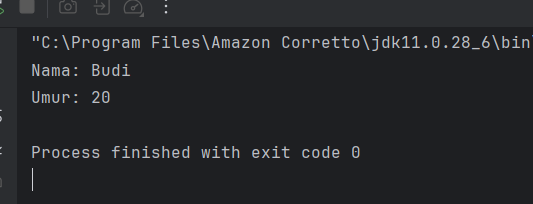

### Latihan
1. Buatlah class Buku dengan atribut judul dan pengarang.
2. Buat object dari class Buku dan isi nilai atributnya.
3. Tampilkan nilai atribut tersebut.

### Langkah Praktikum 
1. Buatkan sebuah package baru di dalam package praktikum_2 dan beri nama latihan. 
2. Kemudian, di dalam package latihan, buat sebuah package baru dengan nama latihan_1
3. Kemudian buat sebuah class baru dengan nama Buku dan isikan kode berikut:

        package praktikum_2.latihan.latihan_1;
    
        public class Buku {
        String judul;
        String pengarang;
    
        // Constructor
        public Buku(String judul, String pengarang) {
            this.judul = judul;
            this.pengarang = pengarang;
        }
    
        // Method untuk menampilkan data
        public void tampilkanInfo() {
            System.out.println("Judul Buku   : " + judul);
            System.out.println("Pengarang    : " + pengarang);
        }
        }
4. Kemudian buat sebuah class baru dengan nama Main dan isikan kode berikut:
```declarative
package praktikum_2.latihan.latihan_1;

public class Main {
    public static void main(String[] args) {
        // Membuat object
        Buku buku1 = new Buku("Hujan", "Tere Liye");

        // Menampilkan data
        buku1.tampilkanInfo();
    }
}
```
5. Jalankan program dan lihat hasilnya

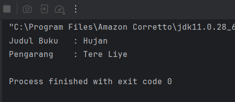

### 2.2 Praktikum 2 - Attribute dan Method
1. Attribute adalah variabel yang dimiliki oleh class atau object.
2. Method adalah fungsi atau perilaku yang dimiliki oleh class atau object.

### Langkah Praktikum
1. Buat Sebuah package baru lagi didalam package praktikum_2 dengan cara klik kanan dan pilih New -> Package. Beri nama bagian_2
2. Kemudian buat sebuah class baru dengan nama  AksesModifier dan isikan kode berikut:
```declarative
package praktikum_2.bagian_2;

public class Kalkulator {
    // Atribut
    int angka1;
    int angka2;

    // Method
    int tambah(){
        return angka1+angka2;
    }
}
```
3. Kemudian buat sebuah class baru dengan nama Main dan isikan kode berikut:
```declarative
package praktikum_2.bagian_2;

public class Main {
public static void main(String[] args) {
Kalkulator kalkulator = new Kalkulator();
kalkulator.angka1 = 5;
kalkulator.angka2 = 10;

System.out.println("Hasil penjumlahan: " + kalkulator.tambah());
}
}
```
4. Jalankan program untuk melihat hasilnya.

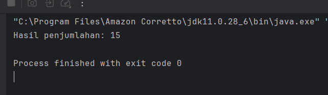

### Latihan
1. Buat class Lingkaran dengan atribut jariJari.
2. Tambahkan method hitungLuas() yang mengembalikan nilai luas lingkaran.
3. Buat object dari class Lingkaran dan panggil method hitungLuas().
### Langkah Praktikum
1. Di dalam package latihan, buat sebuah package baru dengan nama latihan_2
2. Kemudian buat sebuah class baru dengan nama Lingkaran dan isikan kode berikut:
```declarative
package praktikum_2.latihan.latihan_2;

public class Lingkaran {
    double jariJari;

    // Constructor
    public Lingkaran(double jariJari) {
        this.jariJari = jariJari;
    }

    // Method untuk menghitung luas
    public double hitungLuas() {
        return Math.PI * jariJari * jariJari;
    }
}

```
3. Kemudian buat sebuah class baru dengan nama Main dan isikan kode berikut:
```declarative
package praktikum_2.latihan.latihan_2;

public class Main {
public static void main(String[] args) {
// Membuat object
Lingkaran lingkaran1 = new Lingkaran(7);

// Memanggil method hitungLuas()
double luas = lingkaran1.hitungLuas();

// Menampilkan hasil
System.out.println("Luas Lingkaran: " + luas);
}
}

```
4. Jalankan program dan lihat hasilnya

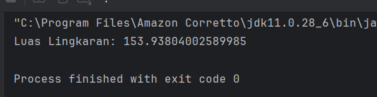

### 2.3 Praktikum 3 - Akses Modifier
1. Akses Modifier menentukan tingkat akses dari class, atribut, atau method.
2. Jenis akses modifier:
public : Dapat diakses dari mana saja.
private : Hanya dapat diakses dalam class yang sama.
protected : Dapat diakses dalam package yang sama dan subclass.
default : Hanya dapat diakses dalam package yang sama.

### Langkah Praktikum
1. Buat Sebuah package baru lagi didalam package praktikum_2 dengan cara klik kanan dan pilih New -> Package. Beri nama bagian_3
2. Kemudian buat sebuah class baru dengan nama AksesModifier dan isikan kode berikut:
```declarative
package praktikum_2.bagian_3;

public class AksesModifier {
public int publicVar =1;
public int privateVar = 2;
protected  int protectedVar = 3;
int defaultVar = 4; // default

public void tampilkan(){
System.out.println("Public : " + publicVar);
System.out.println("Private : " + privateVar);
System.out.println("Protected : " + protectedVar);
System.out.println("Default : " + defaultVar);
}
}

```
3. Kemudian buat sebuah class baru dengan nama Main dan isikan kode berikut:
```declarative
package praktikum_2.bagian_3;

public class Main {
public static void main(String[] args) {
AksesModifier contoh = new AksesModifier();
contoh.tampilkan();

// System.out.println(contoh.privateVar); // Error: privateVar tidak dapat diakses
}
}
```
4. Jalankan program untuk melihat hasilnya.

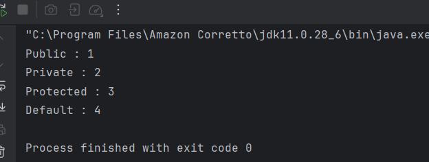

### Latihan
1. Buat class AkunBank dengan atribut saldo (private) dan method tampilkanSaldo() (public).
2. Coba akses atribut saldo langsung dari luar class. Apa yang terjadi?

### Langkah Praktikum
1. Di dalam package latihan, buat sebuah package baru dengan nama latihan_3
2. Kemudian buat sebuah class baru dengan nama AkunBank dan isikan kode berikut:
```declarative
package praktikum_2.latihan.latihan_3;

public class AkunBank {
private double saldo;

// Constructor
public AkunBank(double saldo) {
this.saldo = saldo;
}
 
// Method public untuk menampilkan saldo
public void tampilkanSaldo() {
System.out.println("Saldo: " + saldo);
}

// Getter
public double getSaldo() {
return saldo;
}
}
```
3. Kemudian buat sebuah class baru dengan nama Main dan isikan kode berikut:
```declarative
package praktikum_2.latihan.latihan_3;

public class Main {
public static void main(String[] args) {
AkunBank akun = new AkunBank(1000000);

// Memanggil method
akun.tampilkanSaldo();

// Akses lewat getter (benar)
System.out.println("Saldo: " + akun.getSaldo());
}
}

```
4. Jalankan program dan lihat hasilnya

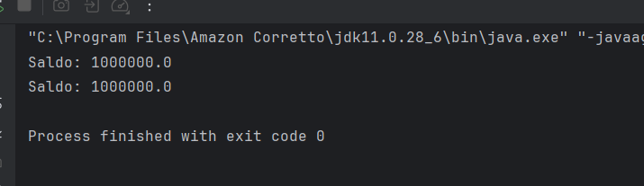

### 2.4 Praktikum 4 - Setter dan Getter
1. Setter adalah method untuk mengubah nilai atribut.
2. Getter adalah method untuk mengambil nilai atribut.
3. Setter dan Getter digunakan untuk mengakses atribut yang memiliki akses modifier private.

### Langkah Praktikum
1. Buat Sebuah package baru lagi didalam package praktikum_2 dengan cara klik kanan dan pilih New -> Package. Beri nama bagian_4
2. Kemudian buat sebuah class baru dengan nama Mobil dan isikan kode berikut:
```declarative
package praktikum_2.bagian_4;

public class Mobil {
private String merk;

// Setter
public void setMerk(String merk) {
this.merk = merk;
}

// Getter
public String getMerk() {
return merk;
}
}
```
3. Kemudian buat sebuah class baru dengan nama Main dan isikan kode berikut:
```declarative
package praktikum_2.bagian_4;

public class Main {
public static void main(String[] args) {
Mobil mobil = new Mobil();
mobil.setMerk("Toyota");

System.out.println("Merk Mobil: " + mobil.getMerk());
}
}
```
4. Jalankan program untuk melihat hasilnya.
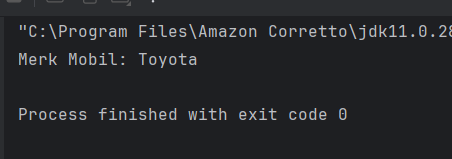

### Latihan
1. Buat class Mahasiswa dengan atribut nama (private) dan nim (private).
2. Buat setter dan getter untuk kedua atribut tersebut.
3. Buat object dari class Mahasiswa dan gunakan setter untuk mengisi nilai atribut.

### Langkah Praktikum
1. Di dalam package latihan, buat sebuah package baru dengan nama latihan_4
2. Kemudian buat sebuah class baru dengan nama Mahasiswa dan isikan kode berikut:
```declarative
package praktikum_2.latihan.latihan_4;

public class Mahasiswa {
// 1. Atribut private
private String nama;
private String nim;

// 2. Setter untuk nama
public void setNama(String nama) {
this.nama = nama;
}

// Getter untuk nama
public String getNama() {
return nama;
}

// Setter untuk nim
public void setNim(String nim) {
this.nim = nim;
}

// Getter untuk nim
public String getNim() {
return nim;
}
}
```
3. Kemudian buat sebuah class baru dengan nama Main dan isikan kode berikut:
```declarative
package praktikum_2.latihan.latihan_4;

public class Main {
public static void main(String[] args) {
// 3. Membuat object dari class Mahasiswa
Mahasiswa mhs = new Mahasiswa();

// Mengisi nilai atribut menggunakan setter
mhs.setNama("Helga Serafina");
mhs.setNim("2023573010023");

// Menampilkan nilai menggunakan getter
System.out.println("--- Data Mahasiswa ---");
System.out.println("Nama : " + mhs.getNama());
System.out.println("NIM  : " + mhs.getNim());
}
}
```
4. Jalankan program dan lihat hasilnya

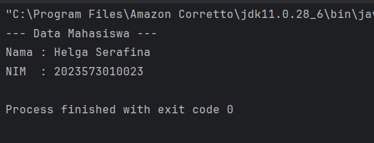

### 2.5 Praktikum 5 - Constructor
1. Constructor adalah method khusus yang dipanggil saat object dibuat.
2. Jenis constructor:
    Default Constructor : Tanpa parameter.
    Parameterized Constructor : Dengan parameter.
    Constructor Overloading : Beberapa constructor dengan parameter berbeda.

### Langkah Praktikum
1. Buat Sebuah package baru lagi didalam package praktikum_2 dengan cara klik kanan dan pilih New -> Package. Beri nama bagian_5
2. Kemudian buat sebuah class baru dengan nama Person dan isikan kode berikut:
```declarative
package modul_2.bagian_5;

public class Person {
private String nama;
private int umur;

// Default Constructor
public Person() {
nama = "Unknown";
umur = 0;
}

// Parameterized Constructor
public Person(String nama, int umur) {
this.nama = nama;
this.umur = umur;
}

// Method
public void tampilkanInfo() {
System.out.println("Nama: " + nama);
}


}
```
3. Kemudian buat sebuah class baru dengan nama Main dan isikan kode berikut:
```declarative
package modul_2.bagian_5;

public class Main {
public static void main(String[] args) {
Person person1 = new Person();
Person person2 = new Person("Budi", 25);

person1.tampilkanInfo();
person2.tampilkanInfo();
}
}
```
4. Jalankan program untuk melihat hasilnya.

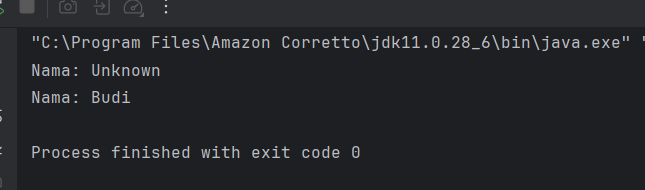

### 2.6 Praktikum 6 - Sistem Manajemen Perpustakaan Sederhana
Berikut adalah contoh program konsol sederhana yang mengimplementasikan seluruh konsep yang telah dibahas sebelumnya, yaitu class, object, attribute, method, akses modifier, setter-getter, dan constructor. Program ini adalah sistem manajemen perpustakaan sederhana yang memungkinkan pengguna untuk menambahkan buku, menampilkan daftar buku, dan mencari buku berdasarkan judul.

### Langkah Praktikum
1. Buat Sebuah package baru lagi didalam package praktikum_2 dengan cara klik kanan dan pilih New -> Package. Beri nama bagian_6
2. Kemudian buat sebuah class baru dengan nama Buku dan isikan kode berikut:
```declarative
package praktikum_2.bagian_6;

public class Buku {
    // Atribut (private)
    private String judul;
    private String pengarang;
    private int tahunTerbit;

    // Constructor (default)
    public Buku() {
        this.judul = "Unknown";
        this.pengarang = "Unknown";
        this.tahunTerbit = 0;
    }

    // Constructor (parameterized)
    public Buku(String judul, String pengarang, int tahunTerbit) {
        this.judul = judul;
        this.pengarang = pengarang;
        this.tahunTerbit = tahunTerbit;
    }

    // Setter dan Getter
    public void setJudul(String judul) {
        this.judul = judul;
    }

    public String getJudul() {
        return judul;
    }

    public void setPengarang(String pengarang) {
        this.pengarang = pengarang;
    }

    public String getPengarang() {
        return pengarang;
    }

    public void setTahunTerbit(int tahunTerbit) {
        this.tahunTerbit = tahunTerbit;
    }

    public int getTahunTerbit() {
        return tahunTerbit;
    }

    // Method untuk menampilkan informasi buku
    public void tampilkanInfo() {
        System.out.println("Judul: " + judul);
        System.out.println("Pengarang: " + pengarang);
        System.out.println("Tahun Terbit: " + tahunTerbit);
        System.out.println("----------------------------");
    }
}
```
3. Kemudian buat sebuah class baru dengan nama Perpustakaan dan isikan kode berikut:
```declarative
package praktikum_2.bagian_6;

import java.util.ArrayList;

public class Perpustakaan {
    // Atribut (private)
    private ArrayList<Buku> daftarBuku;

    // Constructor
    public Perpustakaan() {
        daftarBuku = new ArrayList<>();
    }

    // Method untuk menambahkan buku
    public void tambahBuku(Buku buku) {
        daftarBuku.add(buku);
        System.out.println("Buku berhasil ditambahkan!");
    }

    // Method untuk menampilkan semua buku
    public void tampilkanSemuaBuku() {
        if (daftarBuku.isEmpty()) {
            System.out.println("Tidak ada buku dalam perpustakaan.");
        } else {
            System.out.println("Daftar Buku:");
            for (Buku buku : daftarBuku) {
                buku.tampilkanInfo();
            }
        }
    }

    // Method untuk mencari buku berdasarkan judul
    public void cariBuku(String judul) {
        boolean ditemukan = false;
        for (Buku buku : daftarBuku) {
            if (buku.getJudul().equalsIgnoreCase(judul)) {
                System.out.println("Buku ditemukan:");
                buku.tampilkanInfo();
                ditemukan = true;
                break;
            }
        }
        if (!ditemukan) {
            System.out.println("Buku dengan judul \"" + judul + "\" tidak ditemukan.");
        }
    }
}

```
4. Kemudian buat sebuah class baru dengan nama Main dan isikan kode berikut:
```declarative
package praktikum_2.bagian_6;

import java.util.Scanner;

public class Main {
    public static void main(String[] args) {
        Scanner scanner = new Scanner(System.in);
        Perpustakaan perpustakaan = new Perpustakaan();
        int pilihan;

        do {
            // Menu
            System.out.println("\n=== Sistem Manajemen Perpustakaan ===");
            System.out.println("1. Tambah Buku");
            System.out.println("2. Tampilkan Semua Buku");
            System.out.println("3. Cari Buku");
            System.out.println("4. Keluar");
            System.out.print("Pilih menu: ");
            pilihan = scanner.nextInt();
            scanner.nextLine(); // Membersihkan newline

            switch (pilihan) {
                case 1:
                    // Tambah Buku
                    System.out.print("Masukkan judul buku: ");
                    String judul = scanner.nextLine();
                    System.out.print("Masukkan nama pengarang: ");
                    String pengarang = scanner.nextLine();
                    System.out.print("Masukkan tahun terbit: ");
                    int tahunTerbit = scanner.nextInt();
                    scanner.nextLine(); // Membersihkan newline

                    Buku bukuBaru = new Buku(judul, pengarang, tahunTerbit);
                    perpustakaan.tambahBuku(bukuBaru);
                    break;

                case 2:
                    // Tampilkan Semua Buku
                    perpustakaan.tampilkanSemuaBuku();
                    break;

                case 3:
                    // Cari Buku
                    System.out.print("Masukkan judul buku yang dicari: ");
                    String judulCari = scanner.nextLine();
                    perpustakaan.cariBuku(judulCari);
                    break;

                case 4:
                    // Keluar
                    System.out.println("Terima kasih telah menggunakan sistem ini!");
                    break;

                default:
                    System.out.println("Pilihan tidak valid. Silakan coba lagi.");
            }
        } while (pilihan != 4);

        scanner.close();
    }
}

```
5. Jalankan program untuk melihat hasilnya.

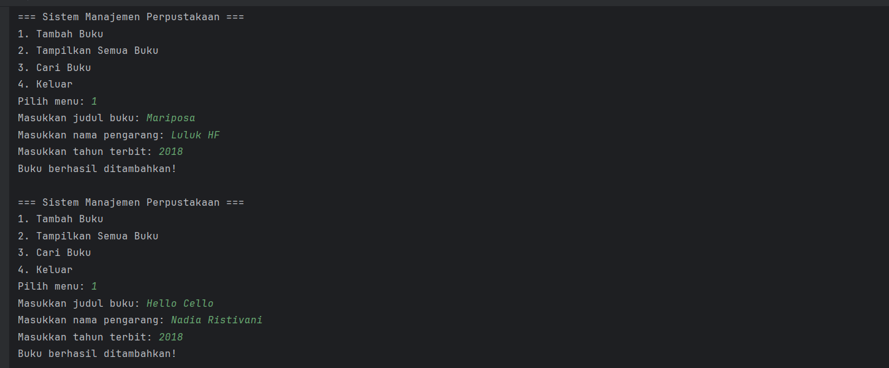
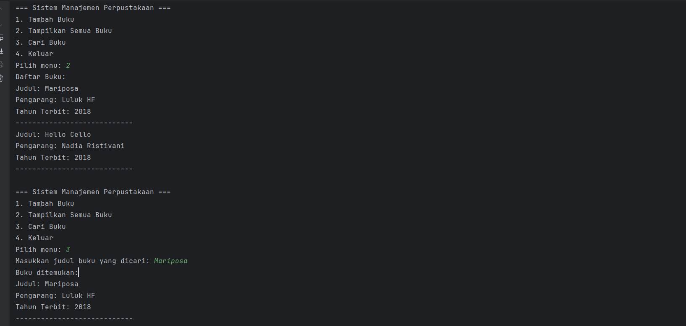
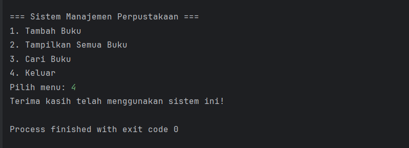

Penjelasan Program:
1. Class Buku:
* Memiliki atribut judul, pengarang, dan tahunTerbit (semua private).
* Menggunakan constructor (default dan parameterized) untuk inisialisasi objek.
* Menggunakan setter dan getter untuk mengakses dan memodifikasi atribut.
* Memiliki method tampilkanInfo() untuk menampilkan informasi buku.

2. Class Perpustakaan:
* Menggunakan ArrayList untuk menyimpan daftar buku.
* Memiliki method tambahBuku(), tampilkanSemuaBuku(), dan cariBuku() untuk mengelola buku.

3. Class Main:
* Menyediakan menu interaktif untuk pengguna.
* Menggunakan Scanner untuk menerima input dari pengguna.
* Mengimplementasikan semua fitur yang telah dibuat di class Buku dan Perpustakaan.


## BAB III - PENUTUP

### 3.1 Kesimpulan
Berdasarkan praktikum yang telah dilakukan, dapat disimpulkan bahwa konsep dasar pemrograman berorientasi objek (OOP) dalam Java meliputi penggunaan class dan object sebagai dasar dalam pembuatan program. Class berfungsi sebagai cetak biru, sedangkan object merupakan implementasi nyata yang memiliki atribut dan method untuk menyimpan data serta menjalankan fungsi tertentu.

Selain itu, penggunaan access modifier seperti public, private, protected, dan default berperan dalam mengatur tingkat akses terhadap data dalam program. Konsep enkapsulasi juga diterapkan melalui penggunaan getter dan setter untuk menjaga keamanan serta kontrol terhadap atribut. Constructor digunakan untuk menginisialisasi objek saat pertama kali dibuat sehingga mempermudah pemberian nilai awal.

Dengan memahami dan menerapkan konsep-konsep tersebut, mahasiswa dapat membuat program yang lebih terstruktur, aman, dan mudah dikembangkan sesuai dengan prinsip dasar OOP.

---

## BAB IV - REFERENSI
* Modul Praktikum 2 by Pak Muhammad Reza Zulman, S.ST., M.Sc.
  https://hackmd.io/@mohdrzu/Bygtu8g0iJg
* W3Schools. *Java OOP Tutorial*.  
  https://www.w3schools.com/java/
* Petani Kode. *Belajar Java OOP untuk Pemula*.  
  https://www.petanikode.com/java-oop/
