# Laporan 3 - 4 Pillar OOP Menggunakan Java
**Mata Kuliah:** Praktikum Design Pattern  
**Nama:** Nisrina Nadhifah Enesta  
**NIM:** 2024573010059  
**Kelas:** TI 2A

---

## BAB I - PENDAHULUAN

## 1.1 Latar Belakang
Perkembangan perangkat lunak yang semakin kompleks menuntut penggunaan metode pemrograman yang terstruktur dan mudah dikelola. Salah satu pendekatan yang banyak digunakan adalah Object Oriented Programming (OOP), yang berfokus pada pengelolaan program melalui objek serta hubungan antar objek.

Dalam OOP terdapat empat pilar utama, yaitu enkapsulasi, inheritance, polymorphism, dan abstraksi. Enkapsulasi digunakan untuk melindungi data dengan membatasi akses melalui method tertentu, inheritance memungkinkan pewarisan sifat dari suatu class ke class lain, polymorphism memberikan fleksibilitas dalam penggunaan method dengan nama yang sama, sedangkan abstraksi menyederhanakan kompleksitas dengan hanya menampilkan bagian penting dari suatu objek.

Melalui praktikum ini, mahasiswa diharapkan dapat memahami dan mengimplementasikan keempat pilar OOP tersebut sehingga mampu membangun program yang lebih terstruktur, modular, dan mudah dikembangkan.

## 1.2 Tujuan Praktikum
1. Memahami konsep dasar OOP: Class, Object, Encapsulation, Inheritance, Polymorphism, dan Abstraction.
2. Mampu membuat program sederhana menggunakan konsep OOP.
3. Menerapkan prinsip-prinsip OOP dalam menyelesaikan masalah pemrograman.

## BAB II - PRAKTIKUM
## 2.1 Praktikum 1 -  Pengenalan OOP dan Class-Object
OOP (Object-Oriented Programming) adalah paradigma pemrograman yang menggunakan "objek" untuk merepresentasikan data dan metode yang beroperasi pada data tersebut. Konsep dasar OOP:
Class: Blueprint atau template untuk membuat objek.
Object: Instance dari class yang memiliki atribut dan metode.

### Langkah Praktikum
1. Buka project pada praktikum sebelumnya menggunakan intellij IDEA
2. Buat sebuah package baru di dalam folder src dengan cara klik kanan pada folder src kemudian pilih New -> Package. Beri nama praktikum_3.
3. Buat sebuah package baru lagi didalam package praktikum_3 dengan cara klik kanan dan pilih New -> Package. Beri nama bagian_1
4. Kemudian buat sebuah class baru dengan nama Buku dan isikan kode berikut:
```declarative
package praktikum_3.bagian_1;

class Mahasiswa {
// Attribut
String nama;
int umur;

// Metode
void displayInfo() {
System.out.println("Nama: " + nama);
System.out.println("Umur: " + umur);
}
}
```
5. Selanjutnya, buat sebuah class baru dengan nama Main dan isikan kode berikut:
```declarative
package praktikum_3.bagian_1;

class Mahasiswa {
// Attribut
String nama;
int umur;

    // Metode
    void displayInfo() {
        System.out.println("Nama: " + nama);
        System.out.println("Umur: " + umur);
    }
}
```
6. Jalankan dan lihat hasilnya.

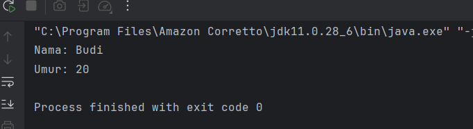
### Analisa Program
Program tersebut mendefinisikan sebuah class `Mahasiswa` yang memiliki dua atribut yaitu `nama` dan `umur`, serta satu metode `displayInfo()` yang berfungsi untuk menampilkan nilai dari atribut tersebut ke layar. Class ini merepresentasikan konsep dasar Object Oriented Programming (OOP), khususnya penggunaan class sebagai blueprint untuk membuat objek. Dengan adanya atribut dan metode dalam satu class, program menunjukkan bagaimana data dan perilaku digabungkan dalam satu kesatuan. Meskipun pada instruksi disebutkan pembuatan class `Buku` dan `Main`, kode yang ditampilkan masih berfokus pada class `Mahasiswa` dan belum menunjukkan proses pembuatan objek maupun pemanggilan metode di dalam class `Main`, sehingga program masih bersifat dasar dan belum lengkap dalam implementasi eksekusinya.


### Latihan
1. Buat class Buku dengan atribut judul, penulis, dan tahunTerbit.
2. Buat objek dari class Buku dan tampilkan informasinya.

### Langkah Praktikum
1. Buatkan sebuah package baru di dalam package praktikum_3 dan beri nama latihan. 
2. Kemudian, di dalam package latihan, buat sebuah package baru dengan nama latihan_1
3. Kemudian buat sebuah class baru dengan nama Mahasiswa dan isikan kode berikut:
```declarative
package praktikum_3.bagian_1;

class Mahasiswa {
    // Attribut
    String nama;
    int umur;

    // Metode
    void displayInfo() {
        System.out.println("Nama: " + nama);
        System.out.println("Umur: " + umur);
    }
}
```
4. Kemudian buat sebuah class baru dengan nama Main dan isikan kode berikut:
```declarative
package praktikum_3.bagian_1;

public class Main {
    public static void main(String[] args) {

        // Membuat objek
        Mahasiswa mhs1 = new Mahasiswa();
        mhs1.nama = "Budi";
        mhs1.umur = 20;

        // Memanggil metode
        mhs1.displayInfo();
    }
}

```
5. Jalankan program dan lihat hasilnya

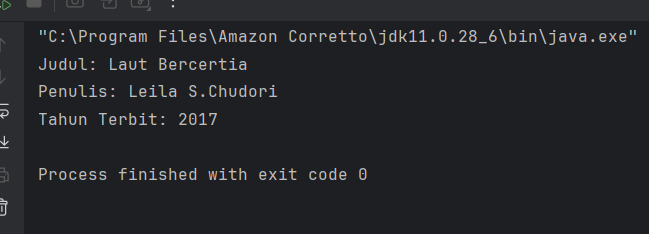

### 2.2 Praktikum 2 - Encapsulation (Enkapsulasi)
Encapsulation adalah konsep menyembunyikan detail internal objek dan hanya mengekspos fungsionalitas yang diperlukan. Ini dilakukan dengan menggunakan access modifier (private, public, protected) dan getter-setter.

### Langkah Praktikum
1. Buat sebuah package baru lagi didalam package praktikum_3 dengan cara klik kanan dan pilih New -> Package. Beri nama bagian_2
2. Kemudian buat sebuah class baru dengan nama Mahasiswa dan isikan kode berikut:
```declarative
package praktikum_3.bagian_2;

class Mahasiswa {

// Atribut private
private String nama;
private int umur;

// Getter dan Setter
public String getNama() {
return nama;
}

public void setNama(String nama) {
this.nama = nama;
}

public int getUmur() {
return umur;
}

public void setUmur(int umur) {
this.umur = umur;
}
}

```
3. Kemudian buat sebuah class baru dengan nama Main dan isikan kode berikut:
```declarative
package praktikum_3.bagian_2;

public class Main {
public static void main(String[] args) {

Mahasiswa mhs1 = new Mahasiswa();
mhs1.setNama("Budi");
mhs1.setUmur(20);

System.out.println("Nama: " + mhs1.getNama());
System.out.println("Umur: " + mhs1.getUmur());
}
}

```
4. Jalankan program untuk melihat hasilnya.

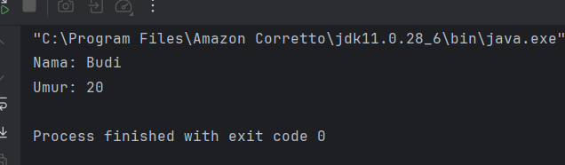

### Analisa Program
Program tersebut menunjukkan penerapan konsep enkapsulasi dalam Object Oriented Programming (OOP) melalui class `Mahasiswa`. Atribut `nama` dan `umur` dibuat bersifat private sehingga tidak dapat diakses langsung dari luar class, melainkan harus melalui method getter dan setter yang bersifat public. Hal ini bertujuan untuk menjaga keamanan data serta mengontrol proses akses dan perubahan nilai atribut. Pada class `Main`, dibuat sebuah objek `mhs1` dari class `Mahasiswa`, kemudian nilai atribut diisi menggunakan setter dan ditampilkan menggunakan getter. Dengan demikian, program ini memperlihatkan bagaimana enkapsulasi bekerja untuk melindungi data sekaligus tetap memungkinkan interaksi yang aman melalui method yang disediakan.


### Latihan
1. Buat class Motor dengan atribut merk dan tahun yang dienkapsulasi.
2. Buat getter dan setter untuk atribut tersebut.

### Langkah Praktikum
1. Buat sebuah package baru lagi didalam package praktikum_3 dengan cara klik kanan dan pilih New -> Package. Beri nama bagian_2
2. Kemudian buat sebuah class baru dengan nama Motor dan isikan kode berikut:

```declarative
package praktikum_3.bagian_2.latihan_2;

public class Motor {
// Atribut (dienkapsulasi)
private String merk;
private int tahun;

// Constructor
public Motor(String merk, int tahun) {
this.merk = merk;
this.tahun = tahun;
}

// Getter untuk merk
public String getMerk() {
return merk;
}

// Setter untuk merk
public void setMerk(String merk) {
this.merk = merk;
}

// Getter untuk tahun
public int getTahun() {
return tahun;
}

// Setter untuk tahun
public void setTahun(int tahun) {
this.tahun = tahun;
}
}

```
3. Kemudian buat sebuah class baru dengan nama Main dan isikan kode berikut:
```declarative
package praktikum_3.bagian_2.latihan_2;

public class Main {
public static void main(String[] args) {
Motor motor1 = new Motor("Honda", 2022);

System.out.println("Merk: " + motor1.getMerk());
System.out.println("Tahun: " + motor1.getTahun());

// Mengubah nilai menggunakan setter
motor1.setMerk("Yamaha");
motor1.setTahun(2024);

System.out.println("Merk baru: " + motor1.getMerk());
System.out.println("Tahun baru: " + motor1.getTahun());
}
}
```
4. Jalankan program dan lihat hasilnya

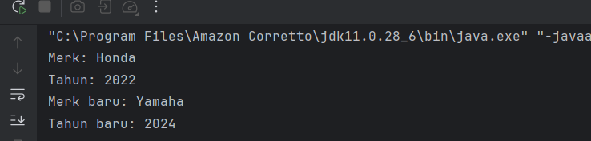

### 2.3 Praktikum 3 - Inheritance (Pewarisan) dan Composition (Komposisi)
Dalam pemrograman berorientasi objek (OOP), Inheritance dan Composition adalah dua konsep penting yang digunakan untuk membangun hubungan antara class. Meskipun keduanya memiliki tujuan yang sama, yaitu mempromosikan reuseability (penggunaan kembali kode) dan modularitas, mereka memiliki pendekatan yang berbeda. Berikut adalah penjelasan lengkap tentang Composition dan perbandingannya dengan Inheritance.

#### 2.3.1 Inheritance (Pewarisan)
Inheritance adalah mekanisme di mana sebuah class (subclass/child class) mewarisi atribut dan metode dari class lain (superclass/parent class). Inheritance menggambarkan hubungan "is-a" (adalah). Misalnya, Kucing adalah Hewan.

Ciri-Ciri Inheritance:
Menggunakan keyword extends.
Subclass mewarisi semua atribut dan metode dari superclass (kecuali yang private).
Subclass dapat menambahkan atribut dan metode baru, atau meng-override metode yang ada.
Mendukung hierarki class (class dapat mewarisi dari satu superclass).

### Langkah Praktikum
1. Buat Sebuah package baru lagi didalam package praktikum_2 dengan cara klik kanan dan pilih New -> Package. Beri nama bagian_3
2. Buat package baru di dalam bagian_3 dan beri nama pewarisan
3. Kemudian buat sebuah class baru dengan nama Kendaraan dan isikan kode berikut:
```declarative
package praktikum_3.bagian_3.pewarisan;

class Kendaraan {
String merk;
int tahun;

void displayInfo() {
System.out.println("Merk: " + merk);
System.out.println("Tahun: " + tahun);
}
}

```
4. Kemudian buat sebuah class baru dengan nama Mobil dan isikan kode berikut:
```declarative
package praktikum_3.bagian_3.pewarisan;

class Mobil extends Kendaraan {
    int jumlahPintu;

    void displayInfoMobil() {
        displayInfo(); // Memanggil metode dari superclass
        System.out.println("Jumlah Pintu: " + jumlahPintu);
    }
}

```

5. Kemudian buat sebuah class baru dengan nama Main dan isikan kode berikut:
```declarative
package praktikum_3.bagian_3.pewarisan;

public class Main {
    public static void main(String[] args) {
        Mobil mobil1 = new Mobil();

        mobil1.merk = "Toyota";
        mobil1.tahun = 2021;
        mobil1.jumlahPintu = 4;

        mobil1.displayInfoMobil();
    }
}
```

6. Jalankan program dan lihat hasilnya.

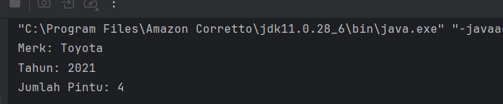

#### 2.3.2 Composition (Komposisi)
1. Composition adalah mekanisme di mana sebuah class terdiri dari objek-objek dari class lain. Ini menggambarkan hubungan "has-a" (memiliki). Misalnya, Mobil memiliki Mesin. Composition memungkinkan kita untuk membangun class yang kompleks dengan menggabungkan objek-objek yang lebih sederhana.
2. Ciri-Ciri Composition:
* Menggunakan instance variabel dari class lain.
* Tidak ada keyword khusus, hanya menggunakan objek sebagai atribut.
* Lebih fleksibel daripada inheritance karena tidak terikat pada hierarki class.
* Mendukung reuseability tanpa perlu mewarisi class.

### Langkah Praktikum
1. Buat package baru di dalam bagian_3 dan beri nama komposisi
2. Kemudian buat sebuah class baru dengan nama Mesin dan isikan kode berikut:
```declarative
package praktikum_3.bagian_3.komposisi;

class Mesin {

    void hidupkan() {
        System.out.println("Mesin menyala.");
    }

    void matikan() {
        System.out.println("Mesin dimatikan.");
    }
}
```
3. Kemudian buat sebuah class baru dengan nama Mobil dan isikan kode berikut:
```declarative
package praktikum_3.bagian_3.komposisi;

class Mobil {

    private final Mesin mesin; // Composition

    public Mobil() {
        this.mesin = new Mesin(); // Membuat objek Mesin
    }

    void mulai() {
        mesin.hidupkan();
        System.out.println("Mobil siap digunakan.");
    }

    void berhenti() {
        mesin.matikan();
        System.out.println("Mobil berhenti.");
    }

}
```

4. Kemudian buat sebuah class baru dengan nama Main dan isikan kode berikut:
```declarative
package praktikum_3.bagian_3.komposisi;

public class Main {
    public static void main(String[] args) {
        Mobil mobil = new Mobil();
        mobil.mulai();
        mobil.berhenti();
    }
}

```
5. Jalankan program dan lihat hasilnya.
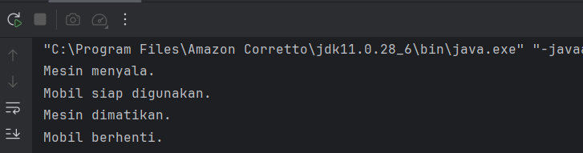

#### 2.3.3 Perbandingan Inheritance dan Composition
1. Perbandingan Inheritance vs Composition

| Aspek        | Inheritance                     | Composition                          |
|--------------|--------------------------------|--------------------------------------|
| Hubungan     | "is-a" (adalah)               | "has-a" (memiliki)                  |
| Fleksibilitas| Kurang fleksibel (terikat hierarki) | Lebih fleksibel (tidak terikat hierarki) |
| Reusability  | Mewarisi semua atribut dan metode | Hanya menggunakan apa yang dibutuhkan |
| Keyword      | extends                        | Tidak ada keyword khusus            |
| Keterikatan  | Kuat (subclass tergantung pada superclass) | Lemah (class independen) |
| Penggunaan   | Cocok untuk class dengan hubungan hierarki yang jelas | Cocok untuk class yang terdiri dari objek-objek lain |

---

2. Kapan Menggunakan Inheritance vs Composition

* Gunakan Inheritance Jika:
- Ada hubungan **"is-a"** yang jelas antara class (contoh: Mobil adalah Kendaraan).
- Ingin mewarisi semua atribut dan metode dari superclass.
- Ingin melakukan **override** metode dari superclass.

* Gunakan Composition Jika:
- Ada hubungan **"has-a"** antara class (contoh: Mobil memiliki Mesin).
- Ingin membangun class dari beberapa objek yang lebih sederhana.
- Ingin mengurangi keterikatan (coupling) antar class.

> Catatan: Inheritance dan Composition juga bisa dikombinasikan dalam satu desain program.


### Langkah Praktikum
1. Di dalam package bagian_3, buat sebuah class baru dan beri nama Main dan isikan kode berikut:
```declarative
package praktikum_3.bagian_3;

// Class untuk Composition
class Mesin {
    void hidupkan() {
        System.out.println("Mesin menyala.");
    }

    void matikan() {
        System.out.println("Mesin dimatikan.");
    }
}

// Superclass untuk Inheritance
class Kendaraan {
    void bergerak() {
        System.out.println("Kendaraan sedang bergerak.");
    }
}

// Subclass yang menggunakan Composition dan Inheritance
class Mobil extends Kendaraan {
    private Mesin mesin; // Composition

    public Mobil() {
        this.mesin = new Mesin(); // Membuat objek Mesin
    }

    void mulai() {
        mesin.hidupkan();
        System.out.println("Mobil siap digunakan.");
    }

    void berhenti() {
        mesin.matikan();
        System.out.println("Mobil berhenti.");
    }
}

public class Main {
    public static void main(String[] args) {
        Mobil mobil = new Mobil();
        mobil.mulai(); // Method dari Composition
        mobil.bergerak(); // Method dari Inheritance
        mobil.berhenti(); // Method dari Composition
    }
}
```
2. Jalankan dan lihat hasilnya.

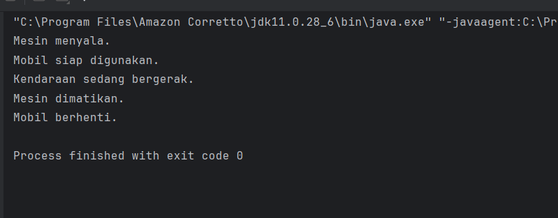

### Analisa Program
Program pada praktikum ini menunjukkan dua konsep penting dalam OOP yaitu **inheritance (pewarisan)** dan **composition (komposisi)**. Pada bagian inheritance, class `Mobil` mewarisi atribut dan method dari class `Kendaraan` menggunakan keyword `extends`, sehingga objek `Mobil` bisa langsung menggunakan atribut seperti `merk` dan `tahun` serta method `displayInfo()`. Hal ini menggambarkan hubungan *“is-a”* dimana Mobil adalah Kendaraan. Sedangkan pada bagian composition, class `Mobil` memiliki objek `Mesin` sebagai atribut, yang menunjukkan hubungan *“has-a”* (Mobil memiliki Mesin). Method dalam class `Mobil` seperti `mulai()` dan `berhenti()` memanfaatkan method dari objek `Mesin`. Dari perbandingan keduanya, terlihat bahwa inheritance digunakan untuk pewarisan sifat antar class, sementara composition lebih fleksibel karena hanya menggunakan objek yang dibutuhkan tanpa terikat pada hierarki. Pada bagian akhir, program menggabungkan kedua konsep tersebut, sehingga satu class bisa memanfaatkan kelebihan inheritance dan composition sekaligus dalam membangun program yang lebih modular dan mudah dikembangkan.


### Latihan
1. Buat class Laptop yang memiliki komponen Processor dan RAM (gunakan composition).
2. Buat class Processor dengan metode jalankan().
3. Buat class RAM dengan metode baca() dan tulis().
4. Implementasikan class Laptop yang menggunakan objek Processor dan RAM.

### Langkah Praktikum
1. Buat sebuah package baru lagi didalam package praktikum_3 dengan cara klik kanan dan pilih New -> Package. Beri nama bagian_latihan3
2. Kemudian buat sebuah class baru dengan nama Laptop dan isikan kode berikut:
```declarative
package praktikum_3.bagian_3.latihan_3;

class Laptop {
    private Processor processor;
    private RAM ram;

    // Constructor (composition)
    Laptop() {
        processor = new Processor();
        ram = new RAM();
    }

    void nyalakanLaptop() {
        System.out.println("Laptop dinyalakan...");
        processor.jalankan();
        ram.baca();
        ram.tulis();
    }
}
```
2. Kemudian buat sebuah class baru dengan nama Processor dan isikan kode berikut:
```declarative
package praktikum_3.bagian_3.latihan_3;

class Processor {

    void jalankan() {
        System.out.println("Processor sedang menjalankan instruksi.");
    }
}

```
2. Kemudian buat sebuah class baru dengan nama RAM dan isikan kode berikut:
```declarative
package praktikum_3.bagian_3.latihan_3;

class RAM {

    void baca() {
        System.out.println("RAM sedang membaca data.");
    }

    void tulis() {
        System.out.println("RAM sedang menulis data.");
    }
}

```
3. Kemudian buat sebuah class baru dengan nama Main dan isikan kode berikut:
```declarative
package praktikum_3.bagian_3.latihan_3;

public class Main {
    public static void main(String[] args) {
        Laptop laptop = new Laptop();
        laptop.nyalakanLaptop();
    }
}

```
4. Jalankan program dan lihat hasilnya

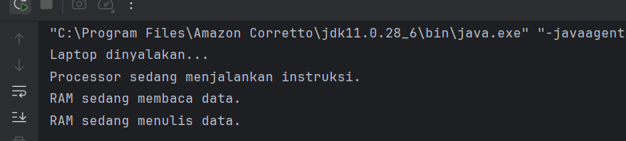

### 2.4 Praktikum 4 - Polymorphism (Polimorfisme)
Polymorphism memungkinkan objek untuk memiliki banyak bentuk. Ini dapat dicapai melalui method overriding (mengganti metode di subclass) dan method overloading (beberapa metode dengan nama sama tetapi parameter berbeda).

#### 2.4.1 Method Overriding
1. Method overriding terjadi ketika subclass (class anak) menyediakan implementasi spesifik untuk method yang sudah didefinisikan di superclass (class induk). Method overriding digunakan untuk mengubah atau memperluas perilaku method yang diwarisi dari superclass. Method yang di-override harus memiliki nama, parameter, dan return type yang sama dengan method di superclass.
2. Aturan Method Overriding:
* Method harus memiliki nama dan parameter yang sama dengan method di superclass.
* Return type harus sama atau subtype dari return type di superclass.
* Access modifier tidak boleh lebih restriktif daripada method di superclass (misalnya, jika method di superclass protected, method di subclass bisa protected atau public).
* Method tidak bisa di-override jika di superclass dideklarasikan sebagai final.

### Langkah Praktikum
1. Buat Sebuah package baru lagi didalam package modul_3 dengan cara klik kanan dan pilih New -> Package. Beri nama bagian_4
2. Kemudian buat sebuah package baru di dalam bagian_4 dan beri nama overriding
3. Kemudian buat sebuah class baru dengan nama Hewan dan isikan kode berikut:
```declarative
package praktikum_3.bagian_4.overriding;

class Hewan {
    void bersuara() {
        System.out.println("Hewan bersuara.");
    }
}
```
4. Kemudian buat sebuah class baru dengan nama Kucing dan isikan kode berikut:
```declarative
package praktikum_3.bagian_4.overriding;

class Kucing extends Hewan {
    @Override
    void bersuara() {
        System.out.println("Meong!");
    }
}
```

5. Kemudian buat sebuah class baru dengan nama Anjing dan isikan kode berikut:
```declarative
package praktikum_3.bagian_4.overriding;

class Anjing extends Hewan {
    @Override
    void bersuara() {
        System.out.println("Guk Guk!");
    }
}
```
6. Kemudian buat sebuah class baru dengan nama Main dan isikan kode berikut:
```declarative
package praktikum_3.bagian_4.overriding;

public class Main {
    public static void main(String[] args) {
        Hewan hewan1 = new Kucing(); // Polymorphism
        Hewan hewan2 = new Anjing(); // Polymorphism

        hewan1.bersuara(); // Output: Meong!
        hewan2.bersuara(); // Output: Guk Guk!
    }
}

```

7. Jalankan program untuk melihat hasilnya.

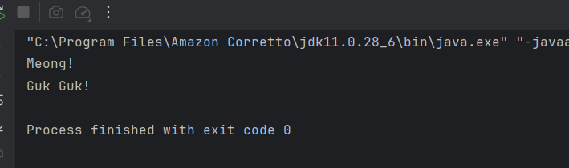

#### 2.4.2 Method Overloading
1. Method overloading terjadi ketika sebuah class memiliki beberapa method dengan nama yang sama tetapi parameter yang berbeda (baik jumlah atau tipe parameternya). Method overloading digunakan untuk meningkatkan fleksibilitas dengan menyediakan beberapa cara untuk memanggil method yang sama.
2. Aturan Method Overloading:
* Method harus memiliki nama yang sama.
* Parameter harus berbeda (jumlah atau tipe).
* Return type bisa sama atau berbeda (tidak mempengaruhi overloading).
* Access modifier bisa sama atau berbeda.

### Langkah Praktikum
1. Buat sebuah package baru di dalam bagian_4 dan beri nama overloading
2. Kemudian buat sebuah class baru dengan nama Kalkulator dan isikan kode berikut:
```declarative
package praktikum_3.bagian_4.latihan_overloading;

class Matematika {

    int tambah(int a, int b) {
        return a + b;
    }

    int tambah(int a, int b, int c) {
        return a + b + c;
    }

    double tambah(double a, double b) {
        return a + b;
    }
}

```
3. Kemudian buat sebuah class baru dengan nama Main dan isikan kode berikut:
```declarative
package praktikum_3.bagian_4.latihan_overloading;

public class Main {
    public static void main(String[] args) {

        Matematika m = new Matematika();

        System.out.println(m.tambah(2, 3));
        System.out.println(m.tambah(1, 2, 3));
        System.out.println(m.tambah(2.5, 3.5));
    }
}
```

4. Jalankan program untuk melihat hasilnya.

 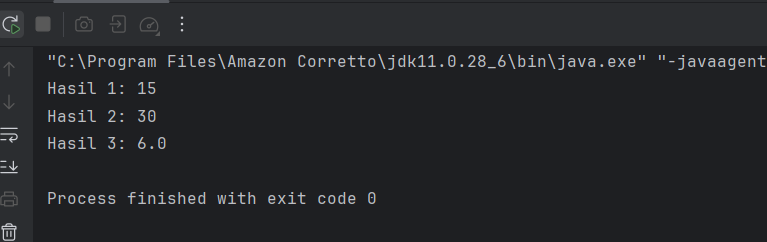

### Perbandingan Overriding dan Overloading

| Aspek       | Overriding                                      | Overloading                                      |
|-------------|--------------------------------------------------|--------------------------------------------------|
| Definisi    | Mengganti implementasi method di subclass       | Membuat method dengan nama sama tetapi parameter berbeda |
| Parameter   | Harus sama                                      | Harus berbeda                                    |
| Return Type | Harus sama atau subtype                         | Bisa berbeda                                     |
| Class       | Terjadi antara superclass dan subclass          | Terjadi dalam satu class                         |
| Tujuan      | Mengubah perilaku method yang diwarisi          | Memberikan fleksibilitas dalam pemanggilan method |
| Keyword     | @Override (opsional)                            | Tidak ada keyword khusus                         |

### Analisa Program
Program pada praktikum ini membahas konsep **polymorphism** melalui dua bentuk yaitu **method overriding** dan **method overloading**. Pada bagian overriding, class `Kucing` dan `Anjing` mewarisi class `Hewan` lalu menimpa (override) method `bersuara()` dengan implementasi yang berbeda, sehingga saat objek dipanggil melalui tipe `Hewan`, output yang dihasilkan tetap sesuai dengan objek aslinya (misalnya “Meong!” atau “Guk Guk!”). Hal ini menunjukkan konsep polymorphism dimana satu method bisa memiliki banyak bentuk. Sedangkan pada bagian overloading, class `Matematika` memiliki beberapa method `tambah()` dengan parameter yang berbeda (jumlah dan tipe data), sehingga method yang dipanggil akan menyesuaikan dengan argumen yang diberikan. Dari praktikum ini dapat dipahami bahwa overriding digunakan saat pewarisan untuk mengubah perilaku method, sedangkan overloading digunakan untuk memberikan variasi pemanggilan method dalam satu class, sehingga program menjadi lebih fleksibel dan mudah digunakan.


### Latihan
**Latihan 1: Overriding**
1. Buat class BangunDatar dengan method hitungLuas().
2. Buat subclass Persegi dan Lingkaran yang meng-override method hitungLuas().
3. Implementasikan method hitungLuas() di masing-masing subclass.

### Langkah Praktikum
1. Di dalam package latihan, buat sebuah package baru dengan nama latihan_4
2. Kemudian buat sebuah class baru dengan nama BangunDatar dan isikan kode berikut:
```declarative
package praktikum_3.bagian_4.latihan_overriding;

class BangunDatar {
    double hitungLuas() {
        return 0;
    }
}

```
3. Kemudian buat sebuah class baru dengan nama Persegi dan isikan kode berikut:
```declarative
package praktikum_3.bagian_4.latihan_overriding;

class Persegi extends BangunDatar {
    double sisi;

    Persegi(double sisi) {
        this.sisi = sisi;
    }

    @Override
    double hitungLuas() {
        return sisi * sisi;
    }
}
```
4. Kemudian buat sebuah class baru dengan nama Lingkaran dan isikan kode berikut:
```declarative
package praktikum_3.bagian_4.latihan_overriding;

class Lingkaran extends BangunDatar {
double jariJari;

Lingkaran(double jariJari) {
this.jariJari = jariJari;
}

@Override
double hitungLuas() {
return Math.PI * jariJari * jariJari;
}
}
```
5. Kemudian buat sebuah class baru dengan nama Main dan isikan kode berikut:
```declarative
package praktikum_3.bagian_4.latihan_overriding;

public class Main {
    public static void main(String[] args) {

        Persegi p = new Persegi(4);
        Lingkaran l = new Lingkaran(7);

        System.out.println("Luas Persegi: " + p.hitungLuas());
        System.out.println("Luas Lingkaran: " + l.hitungLuas());
    }
}

```
6. Jalankan program dan lihat hasilnya
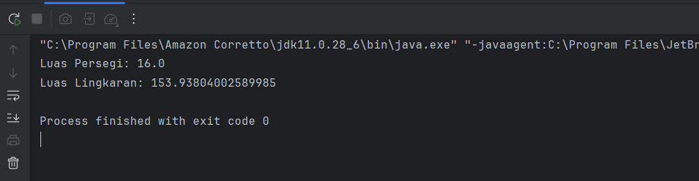


**Latihan 2: Overloading**
1. Buat class Matematika dengan method tambah() yang dapat menerima 2 atau 3 parameter bertipe int.
2. Tambahkan method tambah() yang menerima 2 parameter bertipe double.

### Langkah Praktikum
1. Di dalam package latihan, buat sebuah package baru dengan nama latihan_4
2. Kemudian buat sebuah class baru dengan nama Matematika dan isikan kode berikut:
```declarative
package praktikum_3.bagian_4.latihan_overloading;

class Matematika {

int tambah(int a, int b) {
return a + b;
}

int tambah(int a, int b, int c) {
return a + b + c;
}

double tambah(double a, double b) {
return a + b;
}
}

```
3. Kemudian buat sebuah class baru dengan nama Main dan isikan kode berikut:
```declarative
package praktikum_3.bagian_4.latihan_overloading;

public class Main {
public static void main(String[] args) {

Matematika m = new Matematika();

System.out.println(m.tambah(2, 3));
System.out.println(m.tambah(1, 2, 3));
System.out.println(m.tambah(2.5, 3.5));
}
}
```
4. Jalankan program dan lihat hasilnya

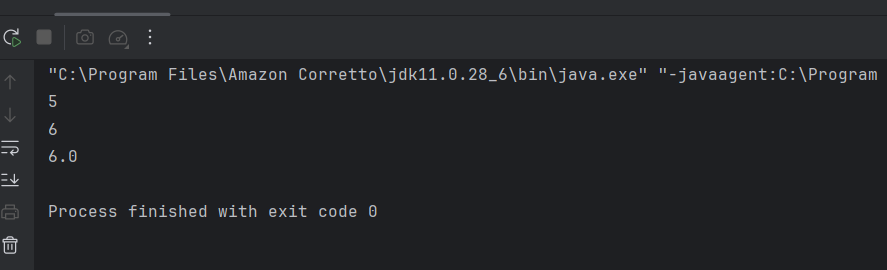

### 2.5 Praktikum 5 - Abstraction (Abstraksi) | Abstract Class dan Interface
Pada konsep OOP (Object-Oriented Programming), Abstraction adalah salah satu dari empat pilar utama (bersama Encapsulation, Inheritance, dan Polymorphism). Abstraction memungkinkan kita untuk menyembunyikan detail implementasi dan hanya menampilkan fungsionalitas yang diperlukan kepada pengguna. Di Java, abstraction dapat diimplementasikan menggunakan Abstract Class dan Interface.

#### 2.5.1 Abstract Class
Abstract class adalah class yang tidak dapat diinstansiasi (tidak bisa dibuat objeknya langsung). Abstract class dapat memiliki method abstrak (tanpa implementasi) dan method konkret (dengan implementasi). Abstract class digunakan ketika kita ingin membuat blueprint untuk class-class lain yang memiliki perilaku serupa tetapi dengan implementasi yang berbeda.

Ciri-Ciri Abstract Class:
Dideklarasikan dengan keyword abstract.
Dapat memiliki atribut, method konkret, dan method abstrak.
Method abstrak tidak memiliki body (hanya deklarasi).
Subclass yang mewarisi abstract class harus mengimplementasikan semua method abstrak (kecuali subclass tersebut juga abstract).

### Langkah Praktikum
1. Buat Sebuah package baru lagi didalam package modul_3 dengan cara klik kanan dan pilih New -> Package. Beri nama bagian_5
2. Buat sebuah package baru di dalam bagian_5 dan beri nama abstrak.
3. Kemudian buat sebuah class baru di dalam abtrak dengan nama Hewan dan isikan kode berikut:
```declarative
package praktikum_3.bagian_5.abstrak;

abstract class Hewan {

    // Atribut
    String nama;

    // Method konkret
    void makan() {
        System.out.println(nama + " sedang makan.");
    }

    // Method abstrak
    abstract void bersuara();
}
```
4. Kemudian buat sebuah class baru di dalam abtrak dengan nama Kucing dan isikan kode berikut:
```declarative
package praktikum_3.bagian_5.abstrak;

//Subclass dari abstract class
class Kucing extends Hewan {
    @Override
    void bersuara() {
        System.out.println("Meong!");
    }
}

```

5. Kemudian buat sebuah class baru di dalam abtrak dengan nama Anjing dan isikan kode berikut:
```declarative
package praktikum_3.bagian_5.abstrak;

class Anjing extends Hewan {
    @Override
    void bersuara() {
        System.out.println("Guk Guk!");
    }
}

```
6. Kemudian buat sebuah class baru dengan nama Main dan isikan kode berikut:
```declarative
package praktikum_3.bagian_5.abstrak;

public class Main {
    public static void main(String[] args) {

        Hewan kucing = new Kucing();
        kucing.nama = "Kitty";
        kucing.makan();     // Method konkret dari abstract class
        kucing.bersuara();  // Method abstrak yang di-override

        Hewan anjing = new Anjing();
        anjing.nama = "Doggy";
        anjing.makan();     // Method konkret dari abstract class
        anjing.bersuara();  // Method abstrak yang di-override
    }
}
```
7. Jalankan program untuk melihat hasilnya.
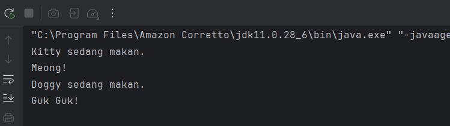

#### 2.5.2 Interface
Interface adalah blueprint untuk class yang hanya berisi method abstrak (sebelum Java 8) atau method default/static (mulai Java 8). Interface digunakan untuk mendefinisikan kontrak (contract) yang harus diimplementasikan oleh class-class yang menggunakannya. Sebuah class dapat mengimplementasikan banyak interface (multiple inheritance).

Ciri-Ciri Interface:
Dideklarasikan dengan keyword interface.
Semua method di interface secara default adalah public dan abstract (tidak perlu menuliskan keyword abstract).
Mulai Java 8, interface dapat memiliki method default (dengan implementasi) dan method static.
Mulai Java 9, interface dapat memiliki method private.
Interface tidak dapat memiliki atribut non-static (hanya konstanta, yaitu public static final).

### Langkah Praktikum
1. Buat sebuah package baru di dalam bagian_5 dan beri nama antarmuka.
2. Kemudian buat sebuah interface baru di dalam antarmuka dengan nama Bergerak dan isikan kode berikut:
```declarative
package praktikum_3.bagian_5.antarmuka;

// Interface
interface Bergerak {

    // Method abstrak
    void bergerak();

    // Method default (Java 8+)
    default void berhenti() {
        System.out.println("Berhenti bergerak.");
    }

    // Method static (Java 8+)
    static void info() {
        System.out.println("Ini adalah interface Bergerak.");
    }
}
```
5. Kemudian buat sebuah class baru di dalam antarmuka dengan nama Mobil dan isikan kode berikut:
```declarative
package praktikum_3.bagian_5.antarmuka;

class Mobil implements Bergerak {
    @Override
    public void bergerak() {
        System.out.println("Mobil sedang melaju.");
    }
}
```
8. Kemudian buat sebuah class baru di dalam antarmuka dengan nama Pesawat dan isikan kode berikut:
```declarative
package praktikum_3.bagian_5.antarmuka;

class Pesawat implements Bergerak {
    @Override
    public void bergerak() {
        System.out.println("Pesawat sedang terbang.");
    }
}
```
11. Kemudian buat sebuah class baru dengan nama Main dan isikan kode berikut:
```declarative
package praktikum_3.bagian_5.antarmuka;

public class Main {
    public static void main(String[] args) {

        Bergerak mobil = new Mobil();
        mobil.bergerak();   // Method dari interface
        mobil.berhenti();   // Method default dari interface

        Bergerak pesawat = new Pesawat();
        pesawat.bergerak();
        pesawat.berhenti();

        Bergerak.info();    // Method static dari interface
    }
}
```
14. Jalankan program untuk melihat hasilnya.
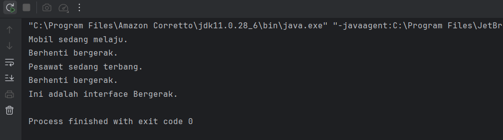


#### 2.5.3 Kapan Menggunakan Abstract Class dan Interface
1. Gunakan Abstract Class Jika:
* Anda ingin membuat blueprint untuk class-class yang memiliki perilaku dan atribut yang sama.
* Anda ingin memiliki method konkret yang dapat diwarisi oleh subclass.
* Anda ingin mengontrol state objek melalui atribut non-static.

2. Gunakan Interface Jika:
* Anda ingin mendefinisikan kontrak atau kemampuan yang harus diimplementasikan oleh class-class yang berbeda.
* Anda ingin mendukung multiple inheritance (sebuah class bisa mengimplementasikan banyak interface).
* Anda ingin menambahkan fungsionalitas tambahan ke class tanpa mengubah struktur class tersebut (menggunakan method default di Java 8+).
* Dalam Sebuah program, kita juga dapat mengkombinasikan abstract class dengan interface.

### Langkah Praktikum
1. Didalam package bagian_5, buatlah sebuah class baru dan beri nama Main dan isikan kode berikut:
```declarative
package praktikum_3.bagian_5;

interface Terbang {
    void terbang();
}

// Abstract Class
abstract class Hewan {
    String nama;

    abstract void bersuara();
}

// Class yang mewarisi abstract class dan mengimplementasikan interface
class Burung extends Hewan implements Terbang {
    @Override
    void bersuara() {
        System.out.println("Kicau kicau!");
    }

    @Override
    public void terbang() {
        System.out.println(nama + " sedang terbang.");
    }
}

public class Main {
    public static void main(String[] args) {
        Burung burung = new Burung();
        burung.nama = "Merpati";
        burung.bersuara();
        burung.terbang();
    }
}

```
2.Jalankan program untuk melihat hasilnya.
 
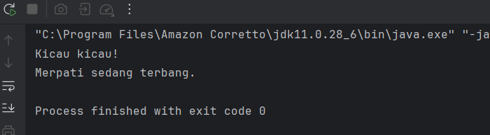

### Analisa Program
Program pada praktikum ini menunjukkan penggunaan **abstract class** dan **interface** dalam OOP. Pada bagian abstract class, class `Hewan` memiliki method konkret (`makan()`) dan method abstrak (`bersuara()`) yang harus diimplementasikan oleh subclass seperti `Kucing` dan `Anjing`. Ini menunjukkan bagaimana abstract class digunakan sebagai kerangka dasar dengan sebagian implementasi. Sedangkan pada bagian interface, `Bergerak` berfungsi sebagai kontrak yang harus diikuti oleh class seperti `Mobil` dan `Pesawat`, dimana masing-masing mengimplementasikan method `bergerak()`. Selain itu, interface juga memiliki method default dan static. Pada bagian akhir, program menggabungkan abstract class dan interface melalui class `Burung`, sehingga satu class bisa memiliki pewarisan sifat sekaligus kemampuan tambahan. Hal ini membuat program lebih fleksibel, modular, dan mudah dikembangkan.


### Latihan 
1. Buat sebuah interface Berenang dengan method berenang().
2. Buat abstract class HewanAir dengan atribut nama dan method abstrak makan().
3. Buat class Ikan yang mewarisi HewanAir dan mengimplementasikan Berenang.
4. Implementasikan method berenang() dan makan() di class Ikan.

### Langkah Praktikum
1. Di dalam package latihan, buat sebuah package baru dengan nama latihan_5
2. Kemudian buat sebuah interface baru dengan nama Berenang dan isikan kode berikut:
```declarative
package praktikum_3.bagian_5.latihan;

interface Berenang {
    void berenang();
}
```
3. Kemudian buat sebuah class baru dengan nama HewanAir dan isikan kode berikut:
```declarative
package praktikum_3.bagian_5.latihan;

abstract class HewanAir {
    String nama;

    HewanAir(String nama) {
        this.nama = nama;
    }

    abstract void makan();
}

```
4. Kemudian buat sebuah class baru dengan nama Ikan dan isikan kode berikut:
```declarative
package praktikum_3.bagian_5.latihan;

class Ikan extends HewanAir implements Berenang {

    Ikan(String nama) {
        super(nama);
    }

    @Override
    void makan() {
        System.out.println(nama + " sedang makan.");
    }

    @Override
    public void berenang() {
        System.out.println(nama + " sedang berenang.");
    }
}

```
5. Kemudian buat sebuah class baru dengan nama Main dan isikan kode berikut:
```declarative
package praktikum_3.bagian_5.latihan;

public class Main {
    public static void main(String[] args) {

        Ikan ikan = new Ikan("Nemo");

        ikan.makan();
        ikan.berenang();
    }
}
```

6. Jalankan program dan lihat hasilnya
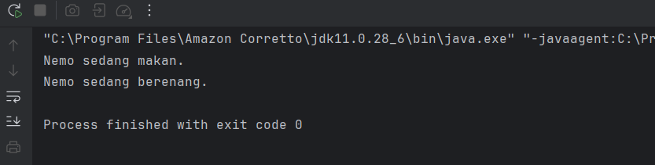


### 2.6 Praktikum 6 - Aplikasi Console Pemesanan Tiket Sederhana
Berikut adalah contoh aplikasi console pemesanan tiket untuk sebuah konferensi yang mengimplementasikan seluruh konsep OOP (Class, Object, Encapsulation, Inheritance, Polymorphism, dan Abstraction). Aplikasi ini memiliki fitur lengkap seperti:

1. Menampilkan daftar tiket yang tersedia.
2. Memesan tiket.
3. Melihat detail pesanan.
4. Membatalkan pesanan.
5. Menghitung total harga.
6. Menerapkan diskon berdasarkan jenis tiket.

### Langkah Praktikum
1. Buat Sebuah package baru lagi didalam package praktikum_3 dengan cara klik kanan dan pilih New -> Package. Beri nama bagian_6
2. Kemudian buat sebuah class baru dengan nama Tiket dan isikan kode berikut:
```declarative
package praktikum_3.bagian_6;

abstract class Tiket {
    private final String jenis;
    private final double harga;

    public Tiket(String jenis, double harga) {
        this.jenis = jenis;
        this.harga = harga;
    }

    public String getJenis() {
        return jenis;
    }

    public double getHarga() {
        return harga;
    }

    // Abstract method untuk menghitung diskon
    public abstract double hitungDiskon();
}
```
3. Kemudian buat sebuah class baru dengan nama TiketReguler dan isikan kode berikut:
```declarative
package praktikum_3.bagian_6;

class TiketReguler extends Tiket {
    public TiketReguler() {
        super("Reguler", 100000); // Harga tiket reguler
    }

    @Override
    public double hitungDiskon() {
        return 0; // Tidak ada diskon untuk tiket reguler
    }
}
```

4. Kemudian buat sebuah class baru dengan nama TiketVIP dan isikan kode berikut:
```declarative
package praktikum_3.bagian_6;

class TiketVIP extends Tiket {
    public TiketVIP() {
        super("VIP", 250000); // Harga tiket VIP
    }

    @Override
    public double hitungDiskon() {
        return 0.1 * getHarga(); // Diskon 10% untuk tiket VIP
    }
}

```
5. Kemudian buat sebuah class baru dengan nama Pesanan dan isikan kode berikut:
```declarative
package praktikum_3.bagian_6;

class Pesanan {
private final String namaPemesan;
private final Tiket tiket;
private final int jumlah;

public Pesanan(String namaPemesan, Tiket tiket, int jumlah) {
this.namaPemesan = namaPemesan;
this.tiket = tiket;
this.jumlah = jumlah;
}

public String getNamaPemesan() {
return namaPemesan;
}

public Tiket getTiket() {
return tiket;
}

public int getJumlah() {
return jumlah;
}

// Menghitung total harga setelah diskon
public double hitungTotal() {
double total = tiket.getHarga() * jumlah;
double diskon = tiket.hitungDiskon() * jumlah;
return total - diskon;
}

// Menampilkan detail pesanan
public void displayDetail() {
System.out.println("\nDetail Pesanan:");
System.out.println("Nama Pemesan: " + namaPemesan);
System.out.println("Jenis Tiket: " + tiket.getJenis());
System.out.println("Jumlah: " + jumlah);
System.out.println("Total Harga: Rp" + hitungTotal());
}
}
```
6. Kemudian buat sebuah class baru dengan nama KonferensiApp dan isikan kode berikut:
```declarative
package praktikum_3.bagian_6;

import java.util.ArrayList;
import java.util.Scanner;

public class KonferensiApp {
    private static final ArrayList<Pesanan> daftarPesanan = new ArrayList<>();
    private static final Scanner scanner = new Scanner(System.in);

    public static void main(String[] args) {
        while (true) {
            System.out.println("\n=== Aplikasi Pemesanan Tiket Konferensi ===");
            System.out.println("1. Lihat Daftar Tiket");
            System.out.println("2. Pesan Tiket");
            System.out.println("3. Lihat Detail Pesanan");
            System.out.println("4. Batalkan Pesanan");
            System.out.println("5. Keluar");
            System.out.print("Pilih menu: ");
            int pilihan = scanner.nextInt();
            scanner.nextLine(); // Membersihkan newline

            switch (pilihan) {
                case 1:
                    lihatDaftarTiket();
                    break;
                case 2:
                    pesanTiket();
                    break;
                case 3:
                    lihatDetailPesanan();
                    break;
                case 4:
                    batalkanPesanan();
                    break;
                case 5:
                    System.out.println("Terima kasih telah menggunakan aplikasi ini.");
                    System.exit(0);
                default:
                    System.out.println("Pilihan tidak valid. Silakan coba lagi.");
            }
        }
    }

    // Method untuk menampilkan daftar tiket
    private static void lihatDaftarTiket() {
        System.out.println("\nDaftar Tiket:");
        System.out.println("1. Tiket Reguler - Rp100.000");
        System.out.println("2. Tiket VIP - Rp250.000 (Diskon 10%)");
    }

    // Method untuk memesan tiket
    private static void pesanTiket() {
        System.out.print("\nMasukkan nama pemesan: ");
        String namaPemesan = scanner.nextLine();

        System.out.print("Pilih jenis tiket (1: Reguler, 2: VIP): ");
        int jenisTiket = scanner.nextInt();
        System.out.print("Masukkan jumlah tiket: ");
        int jumlah = scanner.nextInt();

        Tiket tiket = null;
        switch (jenisTiket) {
            case 1:
                tiket = new TiketReguler();
                break;
            case 2:
                tiket = new TiketVIP();
                break;
            default:
                System.out.println("Jenis tiket tidak valid.");
                return;
        }

        Pesanan pesanan = new Pesanan(namaPemesan, tiket, jumlah);
        daftarPesanan.add(pesanan);
        System.out.println("Pesanan berhasil dibuat!");
        pesanan.displayDetail();
    }

    // Method untuk melihat detail pesanan
    private static void lihatDetailPesanan() {
        if (isNoPesanan()) return;

        System.out.print("Pilih nomor pesanan untuk melihat detail: ");
        int nomorPesanan = scanner.nextInt();
        if (nomorPesanan > 0 && nomorPesanan <= daftarPesanan.size()) {
            daftarPesanan.get(nomorPesanan - 1).displayDetail();
        } else {
            System.out.println("Nomor pesanan tidak valid.");
        }
    }

    private static boolean isNoPesanan() {
        if (daftarPesanan.isEmpty()) {
            System.out.println("\nBelum ada pesanan.");
            return true;
        }

        System.out.println("\nDaftar Pesanan:");
        for (int i = 0; i < daftarPesanan.size(); i++) {
            System.out.println((i + 1) + ". " + daftarPesanan.get(i).getNamaPemesan());
        }

        return false;
    }

    // Method untuk membatalkan pesanan
    private static void batalkanPesanan() {
        if (isNoPesanan()) return;

        System.out.print("Pilih nomor pesanan yang ingin dibatalkan: ");
        int nomorPesanan = scanner.nextInt();
        if (nomorPesanan > 0 && nomorPesanan <= daftarPesanan.size()) {
            daftarPesanan.remove(nomorPesanan - 1);
            System.out.println("Pesanan berhasil dibatalkan.");
        } else {
            System.out.println("Nomor pesanan tidak valid.");
        }
    }
}
```

7. Jalankan program untuk melihat hasilnya.

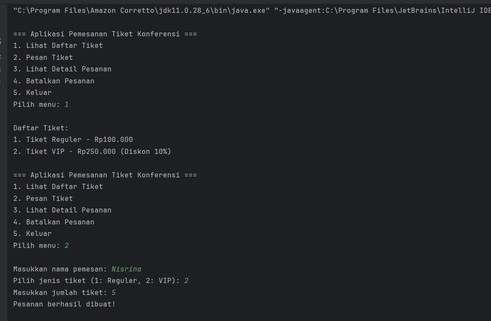
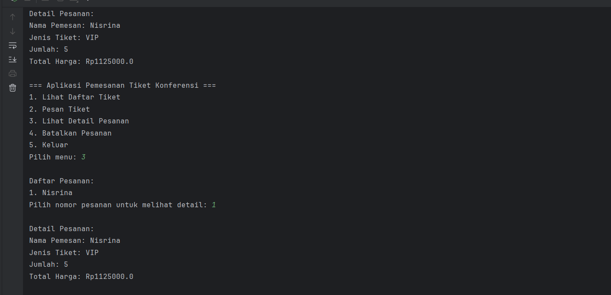
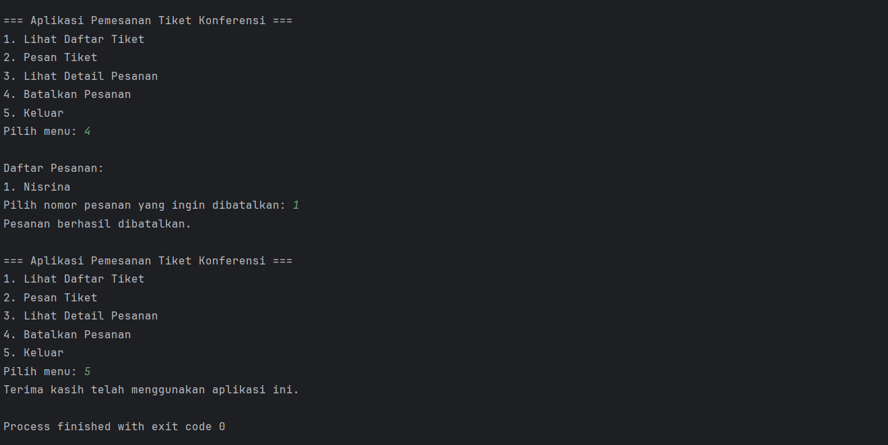

### Analisa Program
Program ini merupakan implementasi konsep Object Oriented Programming (OOP) secara lebih lengkap dalam bentuk aplikasi pemesanan tiket konferensi. Class `Tiket` berperan sebagai abstract class yang menjadi dasar bagi `TiketReguler` dan `TiketVIP`, dimana masing-masing mengimplementasikan method `hitungDiskon()` dengan aturan berbeda, sehingga menunjukkan konsep **abstraksi dan polymorphism**. Class `Pesanan` digunakan untuk merepresentasikan data pemesanan dengan memanfaatkan objek `Tiket` (composition) serta menyediakan method untuk menghitung total harga dan menampilkan detail. Sementara itu, class `KonferensiApp` berfungsi sebagai program utama yang mengatur alur aplikasi menggunakan menu interaktif, serta menyimpan data pesanan dalam `ArrayList`. Program ini menunjukkan bagaimana berbagai konsep OOP seperti encapsulation, inheritance, polymorphism, dan composition dapat digabungkan untuk membangun aplikasi yang terstruktur, modular, dan mudah digunakan.


**Fitur Aplikasi:**
* Lihat Daftar Tiket: Menampilkan jenis tiket dan harganya.
* Pesan Tiket: Memungkinkan pengguna memesan tiket dengan memilih jenis dan jumlah.
* Lihat Detail Pesanan: Menampilkan detail pesanan berdasarkan nomor pesanan.
* Batalkan Pesanan: Menghapus pesanan berdasarkan nomor pesanan.
* Hitung Total Harga: Menghitung total harga setelah diskon (jika ada).

* Encapsulation: Atribut seperti jenis dan harga dienkapsulasi dalam class Tiket.
* Inheritance: TiketReguler dan TiketVIP mewarisi class Tiket.
* Polymorphism: Method hitungDiskon() di-override di subclass.
* Abstraction: Class Tiket adalah abstract class dengan method abstrak hitungDiskon().
* Aplikasi ini siap digunakan dan dapat dikembangkan lebih lanjut dengan menambahkan fitur seperti penyimpanan data ke file atau database

## BAB III - PENUTUP

### 3.1 Kesimpulan
Berdasarkan praktikum yang telah dilakukan, dapat disimpulkan bahwa konsep Object Oriented Programming (OOP) sangat membantu dalam membangun program yang terstruktur dan mudah dikelola. Penerapan empat pilar OOP, yaitu enkapsulasi, inheritance, polymorphism, dan abstraksi, terbukti mampu meningkatkan keamanan data, mempermudah pengembangan program melalui pewarisan, memberikan fleksibilitas dalam penggunaan method, serta menyederhanakan kompleksitas sistem. Dengan memahami dan mengimplementasikan konsep-konsep tersebut, mahasiswa dapat membuat program yang lebih modular, efisien, dan mudah untuk dikembangkan maupun dipelihara di masa depan.

---

## BAB IV - REFERENSI
* Modul Praktikum 2 by Pak Muhammad Reza Zulman, S.ST., M.Sc.
    https://hackmd.io/@mohdrzu/rk5sz2X21l
* W3Schools. *Java OOP Tutorial*.  
  https://www.w3schools.com/java/
* Petani Kode. *Belajar Java OOP untuk Pemula*.  
  https://www.petanikode.com/java-oop/
